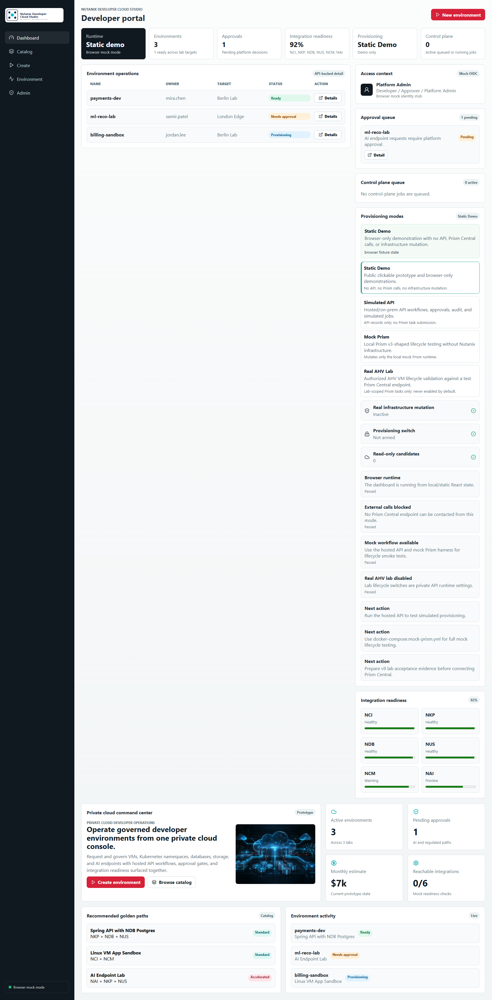

# Nutanix Developer Cloud Studio

A hosted/on-prem internal developer platform prototype for governed environment requests, simulated provisioning, approvals, and operations readiness.

Nutanix Developer Cloud Studio models how developers can request, launch, and govern application environments across Nutanix infrastructure, Kubernetes, databases, storage, and AI services from one self-service portal while platform teams retain policy, approval, audit, and lifecycle control.

Current release: `v9.1.0-prism-element-lab-adapter`

Live demo: https://virtuarchitect.github.io/nutanix-developer-cloud-studio/

## Disclaimer

This repository is an independent product prototype. Nutanix integrations, policy checks, costs, environments, approvals, and provisioning workflows run in simulated mode for demonstration and design validation. This project does not currently provision or mutate real Nutanix infrastructure and is not affiliated with, sponsored by, or endorsed by Nutanix unless explicitly stated otherwise.

## MVP Scope

Nutanix Developer Cloud Studio is currently a polished, simulated hosted/on-prem product prototype. It demonstrates how an internal developer platform can coordinate self-service requests, platform governance, and private-cloud operations before real infrastructure adapters are enabled.

### Developer Experience

- Developer portal dashboard for environment visibility and activity.
- App catalog with golden-path templates.
- Create-environment workflow for VM, Kubernetes, database, storage, and AI endpoint targets.
- Policy, cost, compliance, and approval checks built into the request path.
- Environment status and detail views with simulated provisioning timelines.

### Platform Team Experience

- Admin console for identity context, settings, provider readiness, governance, control-plane jobs, audit/log review, operations evidence, and template management.
- Mock integrations for NCI, NKP, NDB, NUS, NCM, and NAI.
- Template registry, image/profile catalog, policy bundles, and provider configuration views.
- Approval queues, lifecycle operations, audit export manifests, and retention diagnostics.

### Hosted / On-Prem Starter API

- API-backed prototype flows for environments, approvals, simulated provisioning, control-plane jobs, lifecycle destroy simulation, system status, request logging, rate limits, and security headers.
- API-backed Admin Settings surface for identity/RBAC posture, IAM mode selection, local-user policy, Active Directory connectivity references, provider configuration readiness, AHV lab feature flags, and redacted audit-event review.
- Operator console functions for settings validation, connection testing, role mappings, provider drill-down, audit filtering, admin activity review, redacted settings export, operations queue triage, and controlled environment lifecycle actions.
- OIDC-shaped role context, RBAC guardrails, trusted-header diagnostics, and provider credential reference checks.
- State backup/restore tooling and containerized on-prem starter deployment.
- Mock Prism Central simulator for local testing when no Nutanix lab is available.
- API-backed Prism adapter readiness, simulator profile registry, simulator failure scenarios, and controlled real-Prism preflight evidence.
- Runtime package validation, checksum-backed JSON state backup/restore, and Prism adapter contract tests for on-prem readiness.
- Disabled read-only Prism request scaffold, read-only lab gate evidence, fixture inventory contract tests, and operator runbook/rollback pack.
- API auth boundary hardening, runtime observability, production readiness scoring, container/config validation, and a design-only live read-only Prism call contract.
- Controlled read-only lab pilot foundation with lab connection profiles, sanitized Prism fixture replay, authorization gates, operator evidence export packs, and API-backed lab pilot runbook workflow.
- Controlled read-only adapter pilot records for runtime mode selection, live-read-only inventory pilot evidence, redacted adapter observability, lab operator console status, and production readiness decision gates.
- Real read-only lab adapter preparation with config boundaries, credential-provider contracts, disabled adapter interfaces, offline replay suites, and authorized lab connection dry-run evidence.
- Controlled read-only lab enablement with hardened lab profiles, disabled credential resolver stubs, disabled Prism HTTP client shapes, connectivity preflight evidence, and a final non-executing pilot gate.
- Production read-only pilot controls with runtime enablement policy, controlled pilot sessions, non-executing call envelopes, pilot evidence review queue, and emergency stop rollback drill records.
- Controlled mock-to-lab transition with lab readiness workspace, expanded mock Prism endpoint contract, adapter contract harness records, lab dry-run console, evidence export pack v2, and real lab authorization packet evidence.
- Production hardening foundation with API contract baseline, RBAC enforcement matrix, persistence boundary diagnostics, audit integrity manifest, deployment profile validation, and an operations runbook console.
- Durable on-prem operations foundation with Postgres repository contract readiness, migration baseline manifests, JWT/OIDC verification boundary diagnostics, signed audit export manifests, admin upgrade health, and on-prem install profile pack validation.
- Lab-only AHV test infrastructure enablement with Prism Central v3 configuration validation, read-only preflight, opt-in VM create/poll/power/destroy lifecycle, Docker Compose lab deployment, and redacted audit evidence.
- Standalone mock Prism Central harness with fixture-backed clusters, projects, subnets, images, VMs, tasks, Docker Compose deployment, read-only validation, and create/poll/power/destroy/reconciliation smoke testing.
- API-backed provisioning mode selector that clearly distinguishes Static Demo, Simulated API, Mock Prism, and Real AHV Lab modes on the dashboard.
- AHV lab acceptance pack with authorization checklist, execution sequence, evidence report template, and metadata-only validator before authorized Prism Central testing.
- Prism Element lab adapter starter for one-node AHV/PE validation with PE-specific configuration, read-only smoke, and controlled lifecycle provider selection.

### Governance And Release Readiness

- Lab authorization scope evidence, VM lifecycle proof records, rollback/destroy proof reviews, and controlled provisioning gate reviews.
- Disabled AHV create adapter contract reviews and fail-closed AHV controlled-provisioning preflight.
- Platform-service request planning and preflight flows for NKP, NDB, NUS, and NAI.
- Adapter enablement, promotion, CAB, change freeze, production readiness, execution, closure, archive recovery, and operations handoff evidence records.

### Current Boundary

Simulated provisioning is enabled for the prototype control plane. The public GitHub Pages demo never provisions infrastructure. A local mock Prism Central harness can exercise Prism-shaped AHV lifecycle calls without touching Nutanix infrastructure. Real AHV lifecycle is available only in an explicitly configured `APP_ENV=lab` deployment with all AHV lab switches enabled, authorized test infrastructure, private credentials, and Platform Admin approval gates. Prism Central and Prism Element lab providers are separate opt-in modes. All other real Nutanix adapters, Prism calls, credential resolution, and infrastructure mutation remain disabled by default.




## Run The Prototype

Install dependencies:

```powershell
npm install
```

Start the app:

```powershell
npm run dev -- --host localhost --port 4180
```

Open:

`http://localhost:4180`

Build check:

```powershell
npm run build
```

Run unit tests:

```powershell
npm run test
```

Run end-to-end smoke tests:

```powershell
npm run test:e2e
```

Run the full local verification suite:

```powershell
npm run test:all
```

Run on-prem starter validation checks:

```powershell
npm run validate:runtime
npm run validate:onprem
npm run validate:backup
npm run validate:container-config
```

Operator runbooks:

- [Operator runbook](docs/operator-runbook.md)
- [Rollback pack](docs/rollback-pack.md)

## Run The Hosted/On-Prem Starter

Run the mock API locally:

```powershell
npm run api:dev
```

Build the frontend and type-check the API:

```powershell
npm run build:all
```

Run the containerized starter:

```powershell
docker compose up --build
```

Open:

`http://localhost:8080`

In the hosted/on-prem starter, the frontend auto-detects the same-origin API through `/healthz`, loads environments from `/api/environments`, and submits requests to `POST /api/environments`. If no API is available, it falls back to browser mock mode for the public GitHub Pages demo.

Validate the hosted starter locally:

```powershell
.\scripts\validate-hosted-starter.ps1
```

## Run The Mock Prism Central Harness

Use this mode when you want to test the AHV provisioning workflow without a Nutanix lab:

```powershell
Copy-Item .env.mock-prism.example .env.mock-prism
docker compose -f docker-compose.mock-prism.yml --env-file .env.mock-prism up --build
```

Validate the mock Prism endpoint and fixture inventory:

```powershell
npm run validate:mock-prism-config -- -EnvFile .env.mock-prism -PrismUrl http://127.0.0.1:9440
```

Run the mock-backed AHV lifecycle smoke:

```powershell
npm run smoke:mock-prism-lifecycle -- -BaseUrl http://127.0.0.1:8080 -PrismUrl http://127.0.0.1:9440
```

This path submits create, poll, power, and destroy calls to the mock Prism Central service only. It does not contact real Nutanix infrastructure.

## Documentation

Project documentation lives in `docs/`.

To mirror the Markdown notes into a personal Obsidian vault, set `NDC_STUDIO_OBSIDIAN_VAULT` to your local vault path and run:

```powershell
$env:NDC_STUDIO_OBSIDIAN_VAULT="C:\path\to\your\Obsidian Vault"
.\scripts\sync-obsidian.ps1
```

This repo also includes a tracked Git hook in `.githooks/post-commit`. When `NDC_STUDIO_OBSIDIAN_VAULT` is set locally, the hook refreshes the vault after each local commit.

## Development Documentation Rule

As the prototype develops, update `docs/` alongside the code. The key living notes are:

- `docs/project-log.md` for milestones and decisions
- `docs/build-plan.md` for implementation sequencing
- `docs/architecture.md` for product and technical structure
- `docs/roadmap.md` for phase planning
- `docs/project-brief.md` for positioning and scope
- `docs/demo-script.md` for stakeholder walkthroughs
- `docs/hosting.md` for prototype and on-premises hosting direction
- `docs/api.md` for the backend API starter
- `docs/on-prem-deployment.md` for the containerized deployment starter
- `docs/ahv-lab-lifecycle.md` for authorized AHV test infrastructure deployment
- `docs/ahv-lab-acceptance-pack.md` for the formal AHV lab acceptance checklist and evidence requirements
- `docs/mock-prism-central-harness.md` for mock Prism Central lifecycle testing without Nutanix infrastructure
- `docs/release-notes/` for GitHub Release copy
- `docs/upgrade-path.md` for gated phase sequencing and promotion rules

## Repository Standards

This repository also includes project governance and delivery guidance:

- `AGENTS.md`: Codex project instructions and definition of done
- `TESTING_GUIDE.md`: testing strategy and smoke-test requirements
- `SECURITY_REVIEW.md`: defensive security review checklist
- `CODE_REVIEW.md`: review checklist and output format
- `PENTEST_SCOPE_TEMPLATE.md`: authorization template for security testing
- `CONTRIBUTING.md`: contribution workflow
- `SECURITY.md`: vulnerability reporting policy
- `CHANGELOG.md`: release history and planned next changes

## Automation

- `.github/workflows/ci.yml`: runs unit tests, build, and Playwright smoke tests.
- `.github/workflows/security.yml`: runs CodeQL and dependency review checks.
- `.github/workflows/phase-gate.yml`: manually validates a target phase before promotion.
- `.github/workflows/pages.yml`: builds and deploys the static prototype to GitHub Pages when Pages is enabled for the repository.

Changes are complete only when implementation, tests, smoke testing, and any required security review are finished or explicitly documented as blocked.
