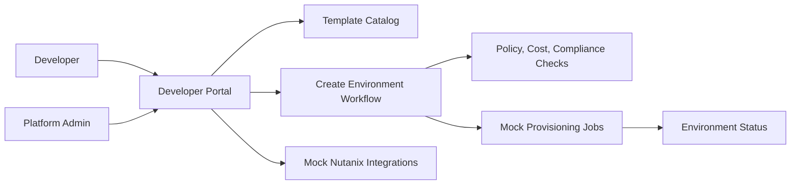
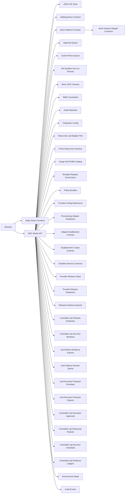

# Nutanix Developer Cloud Studio - Architecture Notes

## MVP Architecture

The MVP starts as a frontend-first React prototype with local mock data.

## Hosted / On-Premises Starter Architecture

The GitHub Pages demo remains a static frontend. The on-premises starter adds a same-origin Node API that can serve the built frontend and expose mock API routes from one container.

## Prototype Domains

- Templates: approved golden paths for apps and services
- Environments: developer-owned requested environments
- Targets: VM, Kubernetes, database, storage, and AI endpoint
- Policies: approval, compliance, cost, region, ownership, and lifecycle rules
- Integrations: NCI, NKP, NDB, NUS, NCM, and NAI
- Jobs: simulated provisioning and operational events
- Control plane jobs: queued orchestration records with worker transitions, retries, failures, and audit evidence
- VM sandbox dry-run plans: AHV VM planning records with validation, quota, cost, expiry, approval evidence, and rollback evidence
- Controlled provisioning gates: operator review records attached to dry-run plans with manual approval, scope, rollback, destroy, and kill-switch evidence
- Lab authorization scopes: versioned project, cluster, network, provider coverage, target endpoint, test window, allowed action, excluded action, evidence reference, rollback owner, and pentest scope evidence
- Rollback/destroy proof records: backup/export evidence, owner notification, teardown order, inventory reconciliation, audit export readiness, and stop conditions tied to VM dry-runs
- Controlled-create authorization envelopes: final evidence rollups for future AHV create authorization, including pentest gate and mutation guardrail status
- AHV create adapter contract reviews: dry-run-to-create payload mapping, blocked mutation operations, and disabled execute/poll/rollback boundary
- VM lifecycle proofs: controlled gate, rollback, and destroy verification records
- AHV controlled-provisioning runs: fail-closed preflight records for controlled create/destroy readiness
- Platform-service requests: NKP, NDB, NUS, and NAI planning records gated by VM lifecycle proof
- Platform-service preflight runs: fail-closed adapter readiness records for NKP, NDB, NUS, and NAI
- Platform-service adapter contract reviews: disabled provider payload previews, blocked operations, and per-provider kill switch state for NKP, NDB, NUS, and NAI
- Provider release gate records: evidence envelopes before NCI, NKP, NDB, NUS, or NAI can be considered for controlled lab release
- Provider release readiness summaries: per-provider evidence gap counts, nearest-to-ready provider, and most-blocked provider
- Release evidence export records: redacted JSON manifest metadata linked to provider release gates
- Controlled lab release runbooks: human sign-off, stop-condition, and escalation evidence before future controlled lab adapter release proposals
- Controlled lab dry-run windows: scheduled evidence-only lab windows linked to runbooks, release exports, lab scope, rollback owners, audit exports, and emergency stop contacts
- Lab window evidence export records: redacted JSON manifest metadata linked to controlled lab dry-run windows
- Lab evidence review records: platform, security, and operations decisions against lab window evidence exports
- Lab execution proposal envelopes: final evidence rollups before any future controlled lab execution proposal
- Lab execution proposal exports: redacted JSON manifest metadata linked to proposal envelopes
- Controlled lab execution approvals: final human decision records linked to proposal exports
- Controlled lab execution rehearsal packets: frozen evidence packets linked to approved execution gates
- Controlled lab dry-run execution checklists: final operator readiness records linked to rehearsal packets
- Controlled lab execution evidence ledgers: immutable evidence reference records linked to dry-run checklists
- Controlled lab execution readiness attestations: final platform, security, operations, rollback, and sponsor attestation records linked to evidence ledgers
- Execution broker queue records: idempotent operator-review queue records linked to readiness attestations
- Execution broker dispatch approvals: non-executing rollback, pentest, operator, and dispatch-window evidence linked to broker records
- Real-adapter lab scope activations: authorized scope, pentest completion, rollback ownership, bounded target, and manual control evidence linked to dispatch approvals
- Manual real-adapter switch reviews: named operator, second reviewer, maintenance window, switch-state audit, and rollback contact evidence linked to lab scope activations
- Real-adapter switch-state audit packages: pre-change and post-change snapshot, reviewer evidence, rollback timer, and retention evidence linked to manual switch reviews
- Controlled switch configuration requests: operator confirmation, second reviewer acceptance, rollback timer, final dry-run proof, and retention evidence linked to switch-state audit packages
- Switch execution handoff packages: operator run sheet, communications plan, observation window, rollback-owner acceptance, and execution freeze proof linked to controlled switch requests
- Switch execution outcome records: operator result, post-switch validation, rollback decision, incident bridge log, and audit sign-off linked to handoff packages
- Switch closure retention packages: closure owner, retained evidence manifest, lessons learned, rollback timer closure, and final audit retention confirmation linked to outcome records
- Adapter promotion readiness dossiers: promotion owner, retained switch evidence, monitoring plan, rollback drill confirmation, and security acceptance linked to closure packages
- Production adapter authorization packets: production approver, change ticket, release window, emergency rollback authorization, and compliance acceptance linked to promotion dossiers
- Production change freeze records: freeze owner, freeze window, stakeholder notification, rollback standby, and no-change exception plan linked to production authorization packets
- Production CAB handoff packets: CAB owner, agenda reference, risk acceptance, rollback representation, and final go/no-go agenda linked to production change freeze records
- Production CAB decision records: CAB decision, decision authority, condition list, rollback approval, and decision minutes linked to CAB handoff packets
- Production implementation hold records: implementation owner, hold window, condition acceptance, rollback implementation owner, and release freeze acknowledgment linked to CAB decision records
- Production operator assignment records: primary operator, secondary operator, execution channel, rollback operator, and privileged access confirmation linked to implementation hold records
- Production execution readiness records: execution owner, pre-execution checklist, rollback bridge, monitoring observer, and implementation timer linked to operator assignment records
- Production execution authorization records: authorization authority, final go/no-go decision, rollback bridge confirmation, monitoring bridge confirmation, and emergency stop authority linked to execution readiness records
- Production change ticket lock records: change ticket lock, release window lock, approver roster lock, rollback bridge lock, and monitoring bridge lock linked to execution authorization records
- Production final execution packet records: final packet manifest, operator run sheet, communications proof, observation window, and final rollback standby confirmation linked to change ticket lock records
- Production execution hold-point records: hold-point owner, final stop/go checkpoint, rollback timer checkpoint, monitoring readiness checkpoint, and incident bridge checkpoint linked to final execution packet records
- Production execution outcome authorization records: outcome authority, expected result envelope, rollback decision rule, incident declaration rule, and evidence capture rule linked to execution hold-point records
- Production execution closure authorization records: closure authority, success criteria, rollback closure criteria, incident closure criteria, and audit capture confirmation linked to outcome authorization records
- Production execution closure packet records: closure packet manifest, evidence bundle, audit export, stakeholder notification proof, and retention handoff confirmation linked to closure authorization records
- Production execution archival handoff records: archive owner, retention policy, immutable storage proof, audit index, and retrieval test linked to closure packet records
- Production execution retention attestation records: retention owner, retention schedule proof, legal hold check, deletion exception register, and retrieval SLA proof linked to archival handoff records
- Production execution final archive certification records: certification owner, final archive manifest, retention lock proof, compliance sign-off, and retrieval witness proof linked to retention attestation records
- Production execution completion dossier records: dossier owner, final evidence index, audit export reference, operations acceptance, and compliance closure proof linked to final archive certification records
- Production execution operations handover records: operations owner, support model reference, monitoring handover proof, escalation route, and service desk acceptance linked to completion dossier records
- Production execution support readiness records: support owner, runbook acceptance, alert routing proof, incident process reference, and knowledge base publication linked to operations handover records
- Production execution service acceptance records: service owner, acceptance criteria reference, operational SLO reference, support sign-off, and final customer notification linked to support readiness records
- Production execution final turnover records: turnover owner, final service catalog reference, ownership transfer proof, executive closure note, and post-implementation review schedule linked to service acceptance records
- Production execution operational closure records: closure owner, steady-state operating model, SLO review proof, support backlog handoff, and residual-risk acceptance linked to final turnover records
- Production execution post-implementation review records: review owner, PIR minutes, incident review proof, cost variance review, and improvement backlog reference linked to operational closure records
- Production execution improvement closure records: improvement owner, action register, accepted deferrals, lessons-learned publication, and next-cycle owner linked to post-implementation review records
- Production execution final acceptance archive records: archive owner, acceptance archive index, final evidence checksum, stakeholder receipt proof, and retrieval owner linked to improvement closure records
- Production execution readiness archive handoff records: handoff owner, archive repository reference, retrieval runbook, archive access review, and archive custody receipt linked to final acceptance archive records
- Production execution archive retrieval validation records: retrieval operator, sample retrieval proof, checksum verification, access audit, and recovery SLA witness linked to readiness archive handoff records
- Production execution archive recovery drill records: drill owner, recovery scenario, elapsed recovery proof, restored artifact review, and drill sign-off linked to archive retrieval validation records
- Production execution archive recovery acceptance records: acceptance owner, recovery evidence packet, RTO/RPO variance review, residual recovery risk register, and acceptance sign-off linked to archive recovery drill records
- Production execution archive recovery closure records: closure owner, recovery closure packet, follow-up action register, stakeholder closure notice, and archive recovery closure sign-off linked to archive recovery acceptance records
- Production execution archive recovery audit certification records: certification owner, audit evidence manifest, control-mapping review, exception disposition, and audit certification sign-off linked to archive recovery closure records
- Production execution archive recovery final compliance archive records: compliance archive owner, final compliance archive index, evidence retention proof, audit witness receipt, and final compliance archive sign-off linked to archive recovery audit certification records
- Production execution archive recovery evidence custody closure records: custody owner, final custody ledger, evidence transfer receipt, retention lock confirmation, and custody closure sign-off linked to final compliance archive records
- Production execution archive recovery operational continuity records: continuity owner, runbook update, KPI baseline, support handoff, and continuity sign-off linked to evidence custody closure records
- Production execution archive recovery service management handoff records: service owner, support queue mapping, knowledge article, escalation matrix, and service management handoff sign-off linked to operational continuity records
- Production execution archive recovery support ownership acceptance records: support owner, service desk acceptance, escalation test proof, monitoring ownership proof, and support ownership sign-off linked to service management handoff records
- Production execution archive recovery monitoring ownership closure records: monitoring owner, alert ownership transfer, dashboard acceptance, escalation monitoring validation, and monitoring ownership closure sign-off linked to support ownership acceptance records
- Production execution archive recovery final operations handoff records: final operations owner, runbook publication, on-call schedule handoff, monitoring closure acceptance, and operations handoff sign-off linked to monitoring ownership closure records
- Production readiness reviews: release-gate rollups for identity, persistence, audit, lab, lifecycle, preflight, and provisioning guardrail evidence
- Resource profiles: AHV images, NKP versions, NDB engines, NUS storage classes, and NAI endpoint profiles
- Template registry: versioned golden-path publication state and approval evidence
- Policy bundles: reusable governance control groups mapped to template versions
- Platform config: provider project, cluster, network, and credential-reference placeholders
- Provisioning adapters: validate, plan, provision, poll, and destroy contract readiness records
- Adapter enablement records: provider evidence reviews with lab scope, credential reference, readiness, audit, rollback, and blocked mutation operation checks
- Approvals: platform review records for AI endpoint and regulated-style requests
- Audit events: request and decision records for hosted/on-prem workflow visibility
- Session: mocked identity and role context for OIDC-ready UX
- RBAC: role checks for mutating developer, approver, and platform admin actions
- Integration config: endpoint/profile placeholders and readiness status for lab planning
- Lab adapters: read-only discovery candidates with provisioning explicitly disabled
- Prism inventory: read-only cluster, project, image, network, category, and VM metadata imported for registry planning

## Integration Boundary

The first implementation should keep real infrastructure integration behind a clean boundary. Mock providers can be replaced later by Nutanix API adapters without rewriting the product workflow.

Future adapters may connect to Prism Central, NCM Self-Service, NKP, NDB, NUS, NAI, Terraform, Crossplane, or Kubernetes APIs.

## Current Implementation

- Vite, React, and TypeScript
- Domain mock data in `src/data/cloudStudioData.ts`
- Mock provisioning service in `src/services/provisioningService.ts`
- Backend-shaped Nutanix adapter contracts in `src/services/nutanixAdapters.ts`
- Requested environments persisted in browser local storage
- Real-adapter switch-state audit package API and Admin Operations audit UI
- Controlled switch request API and Admin Operations request UI
- Switch execution handoff package API and Admin Operations handoff UI
- Switch execution outcome record API and Admin Operations outcome UI
- Switch closure retention package API and Admin Operations closure UI
- Adapter promotion readiness dossier API and Admin Operations promotion UI
- Production adapter authorization packet API and Admin Operations authorization UI
- Production change freeze record API and Admin Operations freeze UI
- Production CAB handoff packet API and Admin Operations CAB handoff UI
- Production CAB decision record API and Admin Operations CAB decision UI
- Production implementation hold record API and Admin Operations implementation hold UI
- Production operator assignment record API and Admin Operations operator assignment UI
- Production execution readiness record API and Admin Operations execution readiness UI
- Production execution authorization record API and Admin Operations execution authorization UI
- Production change ticket lock record API and Admin Operations change ticket lock UI
- Production final execution packet record API and Admin Operations final execution packet UI
- Production execution hold-point record API and Admin Operations execution hold-point UI
- Production execution outcome authorization record API and Admin Operations outcome authorization UI
- Production execution closure authorization record API and Admin Operations closure authorization UI
- Production execution closure packet record API and Admin Operations closure packet UI
- Production execution archival handoff record API and Admin Operations archival handoff UI
- Production execution retention attestation record API and Admin Operations retention attestation UI
- Production execution final archive certification record API and Admin Operations final archive certification UI
- Production execution completion dossier record API and Admin Operations completion dossier UI
- Production execution operations handover record API and Admin Operations operations handover UI
- Production execution support readiness record API and Admin Operations support readiness UI
- Production execution service acceptance record API and Admin Operations service acceptance UI
- Production execution final turnover record API and Admin Operations final turnover UI
- Production execution operational closure record API and Admin Operations operational closure UI
- Production execution post-implementation review record API and Admin Operations post-implementation review UI
- Production execution archive recovery closure record API and Admin Operations archive recovery closure UI
- Production execution archive recovery audit certification record API and Admin Operations archive recovery audit certification UI
- Production execution archive recovery final compliance archive record API and Admin Operations archive recovery final compliance archive UI
- Production execution archive recovery evidence custody closure record API and Admin Operations archive recovery evidence custody closure UI
- Production execution archive recovery operational continuity record API and Admin Operations archive recovery operational continuity UI
- Production execution archive recovery service management handoff record API and Admin Operations archive recovery service management handoff UI
- Production execution archive recovery final operations handoff record API and Admin Operations archive recovery final operations handoff UI
- Real-adapter switch-state audit packages, controlled switch requests, switch handoff packages, switch outcome records, closure packages, promotion dossiers, production authorization packets, production change freeze records, CAB handoff packets, CAB decision records, implementation hold records, operator assignment records, execution readiness records, execution authorization records, change ticket lock records, final execution packet records, execution hold-point records, execution outcome authorization records, execution closure authorization records, execution closure packet records, execution archival handoff records, execution retention attestation records, execution final archive certification records, execution completion dossier records, execution operations handover records, execution support readiness records, execution service acceptance records, execution final turnover records, execution operational closure records, execution post-implementation review records, execution improvement closure records, execution final acceptance archive records, execution readiness archive handoff records, execution archive retrieval validation records, execution archive recovery drill records, execution archive recovery acceptance records, execution archive recovery closure records, execution archive recovery audit certification records, execution archive recovery final compliance archive records, execution archive recovery evidence custody closure records, execution archive recovery operational continuity records, execution archive recovery service management handoff records, execution archive recovery support ownership acceptance records, execution archive recovery monitoring ownership closure records, and execution archive recovery final operations handoff records are evidence-only records; the prototype does not change switch configuration or promote adapters.
- Admin template governance edits persisted in browser local storage
- Timed mock provisioning state transitions exposed through the provisioning service
- Template details view for golden-path outcomes and readiness notes
- Admin governance controls for prototype template owner and tier edits
- Unit tests in `src/services/provisioningService.test.ts`
- Adapter contract tests in `src/services/nutanixAdapters.test.ts`
- End-to-end smoke test in `tests/e2e/prototype-smoke.spec.ts`
- Generated dashboard bitmap asset in `src/assets/developer-cloud-visual.png`
- Repository-owned dashboard screenshot in `docs/assets/dashboard-screenshot.png`
- Responsive console layout in `src/styles.css`
- GitHub Actions CI and Pages deployment workflows in `.github/workflows`
- Node HTTP API starter in `server/`
- API-backed approval queue and environment detail views
- API-backed system status and read-only lab adapter pilot state
- API-backed control-plane queue and mock orchestrator worker actions
- API-backed resource profile catalog, platform config references, and provisioning adapter readiness
- API-backed template registry governance, policy bundles, and resource profile publication actions
- API-backed Prism read-only inventory import with mock and disabled-real adapter implementations
- OIDC-shaped request context, RBAC guardrails, request IDs, structured logs, rate limits, and security headers
- Optional strict trusted-header mode and session diagnostics
- Provider credential reference diagnostics and validation
- Adapter enablement contract review API and Admin Providers UI
- Lab scope and pentest evidence diagnostics API and Admin Control Plane UI
- Postgres repository scaffold and SQL migration files for production persistence planning
- Postgres repository configuration validator and migration scaffold validation
- AHV VM sandbox dry-run planner for safe validation before any real provisioning phase
- Controlled provisioning gate review API and Admin Control Plane UI
- Lab authorization and VM lifecycle proof APIs plus Admin Control Plane evidence UI
- Rollback/destroy proof API and Admin Control Plane proof UI
- Controlled-create authorization envelope API and Admin Control Plane review UI
- Disabled AHV create adapter contract API and Admin Control Plane payload preview UI
- AHV controlled-provisioning preflight adapter boundary and Admin Control Plane UI
- Platform-service planning API and Admin Control Plane UI for NKP, NDB, NUS, and NAI flows
- Platform-service preflight adapter boundary and Admin Control Plane UI for service readiness checks
- Disabled platform-service adapter contract API and Admin Control Plane payload preview UI
- Provider release gate API and Admin Control Plane evidence envelope UI
- Provider release readiness API and Admin Control Plane comparison UI
- Release evidence export API and Admin Operations manifest UI
- Controlled lab release runbook API and Admin Operations sign-off UI
- Controlled lab dry-run window API and Admin Operations readiness UI
- Lab window evidence export API and Admin Operations manifest UI
- Lab evidence review API and Admin Operations review queue UI
- Lab execution proposal envelope API and Admin Operations readiness UI
- Lab execution proposal export API and Admin Operations manifest UI
- Controlled lab execution approval API and Admin Operations gate UI
- Controlled lab execution rehearsal packet API and Admin Operations packet UI
- Controlled lab dry-run execution checklist API and Admin Operations checklist UI
- Controlled lab execution evidence ledger API and Admin Operations ledger UI
- Controlled lab execution readiness attestation API and Admin Operations attestation UI
- Execution broker queue API and Admin Operations broker UI
- Execution broker dispatch approval API and Admin Operations dispatch approval UI
- Real-adapter lab scope activation API and Admin Operations activation UI
- Manual real-adapter switch review API and Admin Operations switch review UI
- Production readiness review API and Admin Overview UI
- Private-cloud lifecycle operation API and Admin Operations UI
- Audit export readiness API and Admin Operations UI
- Audit export manifests, checksums, and retention diagnostics
- Simulated destroy lifecycle that queues teardown jobs without deleting infrastructure
- JSON file persistence option through `NDC_DATA_FILE`
- On-prem configuration validation and JSON state backup/restore scripts
- Database-ready `ApiRepository` contract for future repository implementations
- Containerized starter deployment through `Dockerfile` and `docker-compose.yml`
- No live Nutanix API calls yet

## Current State Boundaries

- The public GitHub Pages UI state remains local to the React app.
- The on-prem starter API exposes templates, environments, integrations, approvals, provisioning jobs, and audit events over HTTP.
- The API also exposes mock session, role, integration configuration, and readiness-check endpoints.
- The lab adapter pilot and Prism inventory import simulate read-only Prism Central/NCI discovery only; provisioning remains disabled by contract.
- The Mock Prism Central simulator exposes local Prism-shaped health, inventory list, VM-create, and task-poll endpoints for adapter contract testing when no Nutanix lab is available.
- VM-targeted environment requests record mock Prism Central execution evidence with selected project, cluster, image, subnet, task UUID, and no-mutation status.
- Prism imported image records become draft AHV image profile candidates until approved through registry governance.
- The control plane models job orchestration but does not mutate infrastructure.
- The destroy lifecycle is simulated and does not delete infrastructure.
- Provider configuration stores references only and does not store secrets.
- Credential reference validation rejects inline access material before provider configuration is saved.
- Image/profile catalog records are planning metadata until a lab registry source is authorized.
- Template registry and policy bundle records are governance planning metadata until real approval and publishing controls are wired to identity and provisioning gates.
- Environment requests persist across browser refreshes through local storage.
- Admin template governance edits persist across browser refreshes through local storage.
- Job transitions are simulated in the browser with timers.
- Approval states are modeled for AI endpoint requests, and hosted/on-prem mode can approve or reject mock requests through API endpoints.
- Nutanix adapter contracts are mock-only and do not call Prism Central, NKP, NDB, NUS, NCM, or NAI.
- The Mock Prism Central simulator is an internal test double only; it does not persist or mutate real Nutanix resources.
- Mock Prism execution evidence is recorded in API state and displayed in Admin and environment detail views, but it is not a live infrastructure operation.
- The frontend auto-detects the hosted/on-prem API through `/healthz` and falls back to browser mock mode when the API is unavailable.
- Production-foundation controls are starter guardrails. Trusted identity headers must be backed by real OIDC validation before production use.
- Strict trusted identity mode can fail API routes closed when required ingress identity headers are missing; health probes remain public.
- VM sandbox dry-run planning validates candidate inputs but does not create, clone, power, resize, tag, or delete VMs.
- Controlled provisioning gate reviews can be approved or rejected, but approval does not enable real AHV mutation in this release.
- Lab authorization and lifecycle proof records are evidence records only; they do not execute AHV operations.
- Rollback/destroy proof records are evidence records only and do not power off, delete, or reconcile real infrastructure.
- Controlled-create authorization envelopes are evidence rollups only; missing active pentest scope blocks future live adapter authorization.
- AHV create adapter contract reviews map approved payload fields only; execute, poll, and rollback remain disabled.
- Lab scope diagnostics store metadata and evidence references only, not pentest report contents, endpoint secrets, credentials, or tokens.
- AHV controlled-provisioning preflight records checks only; Prism Central mutation calls remain disabled.
- Platform-service requests validate catalog and dependency readiness but do not call NKP, NDB, NUS, or NAI APIs.
- Platform-service preflight records check readiness only; NKP, NDB, NUS, and NAI mutation calls remain disabled.
- Platform-service adapter contract reviews map approved request fields only; execute, poll, and rollback remain disabled.
- Provider release gate records are release evidence only; they do not enable real adapter switches or provider execution.
- Provider release readiness summaries are derived views only; they do not authorize provider execution.
- Release evidence exports contain references and metadata only; inline auth material is redacted before persistence.
- Controlled lab release runbooks record sign-off and stop-condition evidence only; missing sign-offs block completion and do not enable provider execution.
- Controlled lab dry-run windows record scheduling evidence only; missing runbook, lab scope, rollback owner, audit export, or emergency contacts block readiness.
- Lab window evidence exports contain references and metadata only; they do not export provider data or enable provider execution.
- Lab evidence reviews record human review decisions only; missing decisions block completion and rejected packages cannot advance.
- Lab execution proposal envelopes are evidence rollups only; they do not enable real adapter execution.
- Lab execution proposal exports contain references and metadata only; they do not deliver provider data or enable real adapter execution.
- Controlled lab execution approvals record human decisions only; they do not authorize or execute real adapter operations.
- Controlled lab execution rehearsal packets freeze evidence references only; they do not authorize or execute real adapter operations.
- Controlled lab dry-run execution checklists record operator readiness only; they do not authorize or execute real adapter operations.
- Controlled lab execution evidence ledgers freeze immutable evidence references only; they do not authorize or execute real adapter operations.
- Controlled lab execution readiness attestations record final human attestations only; they do not authorize or execute real adapter operations.
- Execution broker queue records are operator-review intake only; they do not dispatch or execute provider adapters.
- Execution broker dispatch approvals are non-executing evidence records; they do not dispatch or execute provider adapters.
- Real-adapter lab scope activations prepare manual switch review evidence only; they do not enable or execute provider adapters.
- Manual real-adapter switch reviews are evidence-only records; the prototype does not change switch configuration.
- Production readiness reviews record release-gate evidence only; they do not enable live provisioning.
- Private-cloud lifecycle operations record extend, suspend, destroy, and rebuild requests as operator workflow evidence only.
- Adapter enablement records review evidence only; an enabled real-adapter switch fails this phase and all mutation operations remain blocked.
- Audit export records prepare retention and redaction metadata only; production export delivery requires configured external storage.
- Audit export manifests checksum retained audit metadata but do not deliver files to external storage yet.
- On-prem backup/restore scripts validate JSON starter state only; production deployments still require durable database backup design.
- Postgres mode validates configuration at startup and remains fail-closed until a runtime driver is approved.

## Real Integration Readiness Questions

- Prism Central / NCI: project IDs, image IDs, network targets, quota model, and credential profile.
- First lab adapter pilot: read-only Prism Central inventory discovery after authorization and scope approval; current implementation keeps live calls disabled.
- NKP: whether namespace creation is owned through NKP APIs or standard Kubernetes APIs.
- NDB: database profile IDs, backup policy defaults, restore test expectations, and approval rules.
- NUS: file/object service targets, quota rules, and storage class mapping.
- NCM: whether Calm/NCM Self-Service blueprints should own the first real provisioning handoff.
- NAI: GPU pool availability, model artifact storage, PII scanning, and approval routing.
