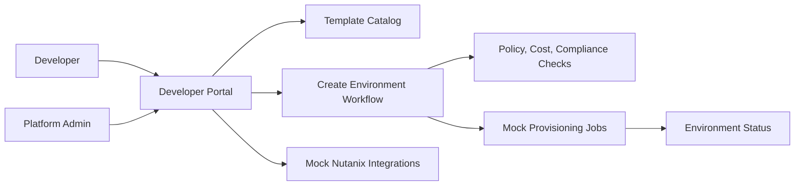

# Nutanix Developer Cloud Studio - Architecture Notes

## MVP Architecture

The MVP starts as a frontend-first React prototype with local mock data.

## Prototype Domains

- Templates: approved golden paths for apps and services
- Environments: developer-owned requested environments
- Targets: VM, Kubernetes, database, storage, and AI endpoint
- Policies: approval, compliance, cost, region, ownership, and lifecycle rules
- Integrations: NCI, NKP, NDB, NUS, NCM, and NAI
- Jobs: simulated provisioning and operational events

## Integration Boundary

The first implementation should keep real infrastructure integration behind a clean boundary. Mock providers can be replaced later by Nutanix API adapters without rewriting the product workflow.

Future adapters may connect to Prism Central, NCM Self-Service, NKP, NDB, NUS, NAI, Terraform, Crossplane, or Kubernetes APIs.

## Current Implementation

- Vite, React, and TypeScript
- Local mock data in `src/App.tsx`
- Generated dashboard bitmap asset in `src/assets/developer-cloud-visual.png`
- Responsive console layout in `src/styles.css`
- No live Nutanix API calls yet
