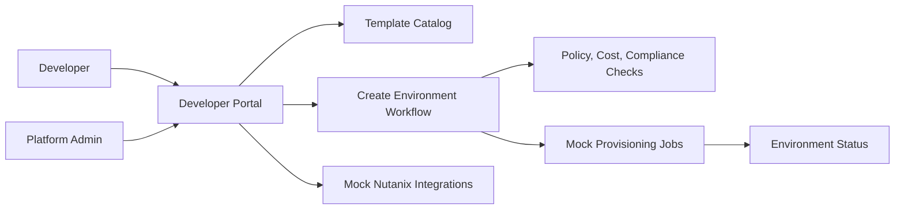

# Nutanix Developer Cloud Studio - Architecture Notes

## MVP Architecture

The MVP starts as a frontend-first React prototype with local mock data.

## Prototype Domains

- Templates: approved golden paths for apps and services
- Environments: developer-owned requested environments
- Targets: VM, Kubernetes, database, storage, and AI endpoint
- Policies: approval, compliance, cost, region, ownership, and lifecycle rules
- Integrations: NCI, NKP, NDB, NUS, NCM, and NAI
- Jobs: simulated provisioning and operational events

## Integration Boundary

The first implementation should keep real infrastructure integration behind a clean boundary. Mock providers can be replaced later by Nutanix API adapters without rewriting the product workflow.

Future adapters may connect to Prism Central, NCM Self-Service, NKP, NDB, NUS, NAI, Terraform, Crossplane, or Kubernetes APIs.

## Current Implementation

- Vite, React, and TypeScript
- Domain mock data in `src/data/cloudStudioData.ts`
- Mock provisioning service in `src/services/provisioningService.ts`
- Requested environments persisted in browser local storage
- Admin template governance edits persisted in browser local storage
- Timed mock provisioning state transitions exposed through the provisioning service
- Template details view for golden-path outcomes and readiness notes
- Admin governance controls for prototype template owner and tier edits
- Unit tests in `src/services/provisioningService.test.ts`
- Generated dashboard bitmap asset in `src/assets/developer-cloud-visual.png`
- Responsive console layout in `src/styles.css`
- No live Nutanix API calls yet

## Current State Boundaries

- UI state remains local to the React app.
- Environment requests persist across browser refreshes through local storage.
- Admin template governance edits persist across browser refreshes through local storage.
- Job transitions are simulated in the browser with timers.
- Approval states are modeled for AI endpoint requests, but no identity or workflow engine is connected.

## Real Integration Readiness Questions

- Prism Central / NCI: project IDs, image IDs, network targets, quota model, and credential profile.
- NKP: whether namespace creation is owned through NKP APIs or standard Kubernetes APIs.
- NDB: database profile IDs, backup policy defaults, restore test expectations, and approval rules.
- NUS: file/object service targets, quota rules, and storage class mapping.
- NCM: whether Calm/NCM Self-Service blueprints should own the first real provisioning handoff.
- NAI: GPU pool availability, model artifact storage, PII scanning, and approval routing.
