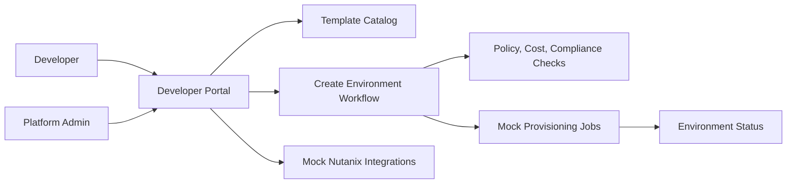
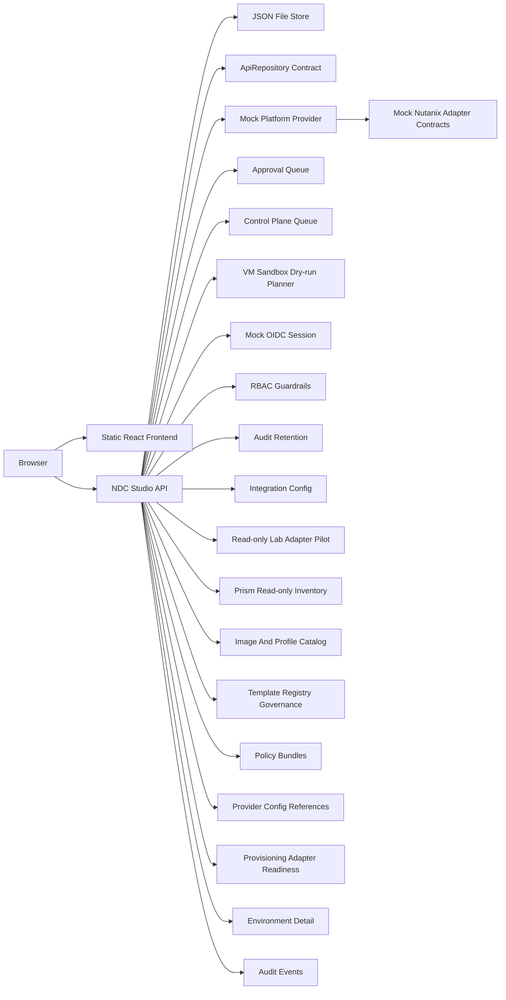

# Nutanix Developer Cloud Studio - Architecture Notes

## MVP Architecture

The MVP starts as a frontend-first React prototype with local mock data.

## Hosted / On-Premises Starter Architecture

The GitHub Pages demo remains a static frontend. The on-premises starter adds a same-origin Node API that can serve the built frontend and expose mock API routes from one container.

## Prototype Domains

- Templates: approved golden paths for apps and services
- Environments: developer-owned requested environments
- Targets: VM, Kubernetes, database, storage, and AI endpoint
- Policies: approval, compliance, cost, region, ownership, and lifecycle rules
- Integrations: NCI, NKP, NDB, NUS, NCM, and NAI
- Jobs: simulated provisioning and operational events
- Control plane jobs: queued orchestration records with worker transitions, retries, failures, and audit evidence
- VM sandbox dry-run plans: AHV VM planning records with validation, quota, cost, expiry, approval evidence, and rollback evidence
- Resource profiles: AHV images, NKP versions, NDB engines, NUS storage classes, and NAI endpoint profiles
- Template registry: versioned golden-path publication state and approval evidence
- Policy bundles: reusable governance control groups mapped to template versions
- Platform config: provider project, cluster, network, and credential-reference placeholders
- Provisioning adapters: validate, plan, provision, poll, and destroy contract readiness records
- Approvals: platform review records for AI endpoint and regulated-style requests
- Audit events: request and decision records for hosted/on-prem workflow visibility
- Session: mocked identity and role context for OIDC-ready UX
- RBAC: role checks for mutating developer, approver, and platform admin actions
- Integration config: endpoint/profile placeholders and readiness status for lab planning
- Lab adapters: read-only discovery candidates with provisioning explicitly disabled
- Prism inventory: read-only cluster, project, image, network, category, and VM metadata imported for registry planning

## Integration Boundary

The first implementation should keep real infrastructure integration behind a clean boundary. Mock providers can be replaced later by Nutanix API adapters without rewriting the product workflow.

Future adapters may connect to Prism Central, NCM Self-Service, NKP, NDB, NUS, NAI, Terraform, Crossplane, or Kubernetes APIs.

## Current Implementation

- Vite, React, and TypeScript
- Domain mock data in `src/data/cloudStudioData.ts`
- Mock provisioning service in `src/services/provisioningService.ts`
- Backend-shaped Nutanix adapter contracts in `src/services/nutanixAdapters.ts`
- Requested environments persisted in browser local storage
- Admin template governance edits persisted in browser local storage
- Timed mock provisioning state transitions exposed through the provisioning service
- Template details view for golden-path outcomes and readiness notes
- Admin governance controls for prototype template owner and tier edits
- Unit tests in `src/services/provisioningService.test.ts`
- Adapter contract tests in `src/services/nutanixAdapters.test.ts`
- End-to-end smoke test in `tests/e2e/prototype-smoke.spec.ts`
- Generated dashboard bitmap asset in `src/assets/developer-cloud-visual.png`
- Repository-owned dashboard screenshot in `docs/assets/dashboard-screenshot.png`
- Responsive console layout in `src/styles.css`
- GitHub Actions CI and Pages deployment workflows in `.github/workflows`
- Node HTTP API starter in `server/`
- API-backed approval queue and environment detail views
- API-backed system status and read-only lab adapter pilot state
- API-backed control-plane queue and mock orchestrator worker actions
- API-backed resource profile catalog, platform config references, and provisioning adapter readiness
- API-backed template registry governance, policy bundles, and resource profile publication actions
- API-backed Prism read-only inventory import with mock and disabled-real adapter implementations
- OIDC-shaped request context, RBAC guardrails, request IDs, structured logs, rate limits, and security headers
- Postgres repository scaffold and SQL migration files for production persistence planning
- AHV VM sandbox dry-run planner for safe validation before any real provisioning phase
- Simulated destroy lifecycle that queues teardown jobs without deleting infrastructure
- JSON file persistence option through `NDC_DATA_FILE`
- Database-ready `ApiRepository` contract for future repository implementations
- Containerized starter deployment through `Dockerfile` and `docker-compose.yml`
- No live Nutanix API calls yet

## Current State Boundaries

- The public GitHub Pages UI state remains local to the React app.
- The on-prem starter API exposes templates, environments, integrations, approvals, provisioning jobs, and audit events over HTTP.
- The API also exposes mock session, role, integration configuration, and readiness-check endpoints.
- The lab adapter pilot and Prism inventory import simulate read-only Prism Central/NCI discovery only; provisioning remains disabled by contract.
- Prism imported image records become draft AHV image profile candidates until approved through registry governance.
- The control plane models job orchestration but does not mutate infrastructure.
- The destroy lifecycle is simulated and does not delete infrastructure.
- Provider configuration stores references only and does not store secrets.
- Image/profile catalog records are planning metadata until a lab registry source is authorized.
- Template registry and policy bundle records are governance planning metadata until real approval and publishing controls are wired to identity and provisioning gates.
- Environment requests persist across browser refreshes through local storage.
- Admin template governance edits persist across browser refreshes through local storage.
- Job transitions are simulated in the browser with timers.
- Approval states are modeled for AI endpoint requests, and hosted/on-prem mode can approve or reject mock requests through API endpoints.
- Nutanix adapter contracts are mock-only and do not call Prism Central, NKP, NDB, NUS, NCM, or NAI.
- The frontend auto-detects the hosted/on-prem API through `/healthz` and falls back to browser mock mode when the API is unavailable.
- Production-foundation controls are starter guardrails. Trusted identity headers must be backed by real OIDC validation before production use.
- VM sandbox dry-run planning validates candidate inputs but does not create, clone, power, resize, tag, or delete VMs.

## Real Integration Readiness Questions

- Prism Central / NCI: project IDs, image IDs, network targets, quota model, and credential profile.
- First lab adapter pilot: read-only Prism Central inventory discovery after authorization and scope approval; current implementation keeps live calls disabled.
- NKP: whether namespace creation is owned through NKP APIs or standard Kubernetes APIs.
- NDB: database profile IDs, backup policy defaults, restore test expectations, and approval rules.
- NUS: file/object service targets, quota rules, and storage class mapping.
- NCM: whether Calm/NCM Self-Service blueprints should own the first real provisioning handoff.
- NAI: GPU pool availability, model artifact storage, PII scanning, and approval routing.
