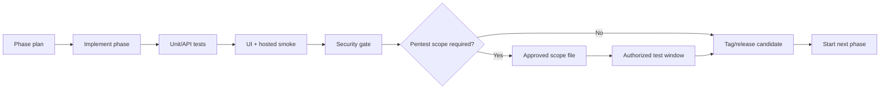

# Nutanix Developer Cloud Studio - Upgrade Path

## Operating Principle

NDC Studio should advance through gated phases. Each phase must prove that the previous phase still works before the next phase is started or promoted.

The gate is deliberately conservative:

- Build and type checks must pass.
- Unit and API tests must pass.
- End-to-end smoke tests must pass.
- Hosted/on-prem starter validation must pass.
- Dependency audit must pass.
- Secret scanning must pass.
- Penetration or vulnerability testing must only run after authorization and scope are documented.

## Phase Promotion Flow



## Automated Gate

Run locally:

```powershell
.\scripts\run-phase-gate.ps1 -TargetPhase v1.0.0-vm-sandbox-dry-run
```

With an explicitly authorized security scope:

```powershell
.\scripts\run-phase-gate.ps1 `
  -TargetPhase v1.0.0-vm-sandbox-dry-run `
  -PentestScopePath .\PENTEST_SCOPE_TEMPLATE.md `
  -IncludeAuthorizedPentest
```

The script does not perform unsafe or out-of-scope testing. It runs defensive checks and verifies that a scope file exists before any active security testing is treated as a release gate.

## Phase Sequence

### v0.5.0-control-plane

Goal: add the provisioning control-plane skeleton without real infrastructure mutation.

Build:

- Provisioning job queue domain.
- Worker/orchestrator abstraction.
- Job state machine: queued, validating, awaiting approval, provisioning, ready, failed, expired.
- Retry and failure model.
- Audit evidence for every state transition.
- UI for queued/running/failed jobs.
- Provisioning remains disabled unless an adapter explicitly supports a safe action.

Exit gate:

- Existing smoke tests pass.
- Hosted validation passes.
- Job queue tests cover success, failure, retry, and approval pause.
- Security review confirms no untrusted shell execution or unsafe path handling.

### v0.6.0-provisioning-adapters

Goal: define adapter contracts and what the platform is allowed to create.

Build:

- Provisioning adapter contract for validate, plan, provision, poll, and destroy.
- AHV image registry records.
- NKP namespace/profile registry records.
- NDB profile registry records.
- NUS storage class registry records.
- NAI/GPU endpoint profile records.
- Platform configuration references.
- Simulated destroy lifecycle with teardown queue evidence.

Exit gate:

- Adapter and provider inventory endpoints are covered by tests.
- Destroy lifecycle queues a simulated teardown job.
- Smoke test covers provider readiness and destroy lifecycle.
- Security review covers configuration and sensitive endpoint handling.

### v0.7.0-registry-governance

Goal: govern template and profile publication before real integration.

Build:

- Template version states: draft, published, deprecated.
- Resource profile states and deprecation controls.
- Owner approval before publishing.
- Policy bundle selection per version.

Exit gate:

- Registry governance APIs are covered by unit/API/client tests.
- Admin smoke test covers registry and profile status transitions.
- Audit evidence is written for governance actions.
- Published status remains a planning record and does not enable real provisioning.

### v0.8.0-prism-readonly-inventory

Goal: move from simulated discovery toward real read-only Prism Central inventory.

Build:

- Adapter interface for Prism Central inventory.
- Read-only endpoint configuration.
- Inventory import model for clusters, projects, images, networks, categories, and VMs.
- Discovery evidence and last-sync metadata.
- No create/update/delete API calls.

Exit gate:

- Mock adapter tests pass.
- Real adapter remains disabled unless lab scope is approved.
- Authorized scope file exists before any live endpoint testing.
- Smoke test proves imported inventory appears in registry/admin views.

### v0.9.0-production-foundation

Goal: turn the starter into a production-shaped control plane before enabling real provisioning.

Build:

- OIDC session validation.
- Role-based access control for admin, approval, registry, integration, and provisioning actions.
- Postgres repository implementation and migrations.
- Audit retention model and export boundary.
- Request logging, correlation IDs, rate limits, and security headers.
- CI gates for dependency review, CodeQL, SBOM, and container image scanning.

Exit gate:

- Auth and authorization tests cover permitted and denied access.
- Migration and repository tests pass against a disposable database.
- Security review confirms request logging redacts sensitive values.
- Production deployment remains provisioning-disabled by default.

### v1.0.0-vm-sandbox-dry-run

Goal: design the first VM sandbox path as dry-run only.

Build:

- Linux VM App Sandbox dry-run planning adapter.
- Fixed image/profile/subnet choices from approved registry.
- Owner, cost, expiry, and environment tags.
- Quota, category, image, subnet, project, and expiry validation.
- Approval evidence and rollback/destroy plan preview.

Exit gate:

- Penetration/security scope is approved.
- Test lab is explicitly in scope.
- Dry-run mode passes.
- Manual approval gate is required before real provisioning is enabled.

### v1.1.0-controlled-provisioning

Goal: add the operator gate required before a future narrowly scoped VM provisioning path can be enabled.

Build:

- Controlled provisioning gate attached to VM sandbox dry-run plans.
- Manual approval required for every real create request.
- Rollback and destroy readiness evidence with operator confirmation.
- Runtime kill switch evidence that keeps all mutation calls disabled by default.
- Audit evidence for request, approval, and rejection decisions.

Exit gate:

- Gate request and approval workflow is API-backed and audited.
- Authorized lab scope and test window are still required before real create work.
- Pentest gate remains required for any scoped lab target.
- Real provisioning remains disabled until a future adapter phase.

### v1.2.0-platform-services

Goal: add platform-service planning flows while gating real service provisioning on VM lifecycle proof.

Build:

- NKP namespace request planning.
- Resource quota and network policy metadata.
- NDB profile-backed PostgreSQL request planning.
- NUS storage allocation request planning.
- NAI endpoint request planning with GPU quota and safety approval evidence.
- Backup, retention, rollback, and cleanup metadata.

Exit gate:

- VM lifecycle proof is required before service provisioning can be enabled.
- Each service has rollback/cleanup documentation.
- Stateful services require approval.
- Smoke tests cover blocked planning paths.

### v1.3.0-lifecycle-evidence

Goal: record the evidence required before private-cloud developer platform promotion.

Build:

- Lab authorization scope records.
- Pentest scope evidence.
- VM lifecycle proof records.
- Controlled gate linkage to active lab scope.
- Platform-service linkage to lifecycle proof.

Exit gate:

- Evidence APIs and UI are tested.
- Lifecycle proof remains blocked until controlled create gate is truly approved.
- Real provisioning remains disabled until authorized adapter work.

### v1.4.0-ahv-preflight-boundary

Goal: add the fail-closed AHV execution boundary before any real adapter work.

Build:

- AHV controlled-provisioning adapter interface.
- Disabled real-adapter preflight run records.
- Checks for controlled gate, active lab scope, lifecycle proof, controlled create switch, and adapter enablement.
- Blocked mutation operation evidence.

Exit gate:

- Preflight APIs and UI are tested.
- Prism Central mutation calls remain disabled.
- Real provisioning remains disabled until authorized adapter work.

### v1.5.0-platform-service-preflight

Goal: add fail-closed service adapter boundaries before any real NKP, NDB, NUS, or NAI adapter work.

Build:

- Platform-service preflight adapter interface.
- Disabled real-adapter preflight records for NKP, NDB, NUS, and NAI.
- Checks for request validation, VM lifecycle proof, provider readiness, adapter configuration, and real-adapter switch state.
- Provider-specific blocked operation evidence.

Exit gate:

- Preflight APIs and UI are tested.
- NKP, NDB, NUS, and NAI mutation calls remain disabled.
- Real service provisioning remains disabled until authorized adapter work.

### v1.6.0-production-readiness-review

Goal: record release-gate readiness before any private-cloud platform candidate.

Build:

- Production readiness review records.
- Checks for OIDC boundary, durable state, audit retention, lab authorization, VM lifecycle proof, AHV preflight, platform-service preflight coverage, and provisioning guardrail.
- Admin Overview readiness review UI.

Exit gate:

- Readiness review APIs and UI are tested.
- Review remains evidence-only and does not enable provisioning.
- Blocked checks are visible before private-cloud promotion.

### v1.7.0-private-cloud-developer-platform

Goal: release as an operational internal developer platform candidate.

Build:

- Private-cloud lifecycle operation records.
- Lifecycle operations: extend, suspend, destroy, rebuild.
- Audit export readiness records.
- Admin Operations console.
- Operational runbooks.

Exit gate:

- Lifecycle operation and audit export APIs are covered by tests.
- Admin smoke test covers operations and audit export preparation.
- Production readiness review remains visible before operational promotion.
- Real provisioning remains disabled until an authorized adapter phase.

### v1.8.0-on-prem-packaging-hardening

Goal: harden the private-cloud starter for on-prem deployment evaluation.

Build:

- Compose profile for API, static UI, and durable JSON state.
- Deployment environment matrix for reverse proxy, OIDC headers, data file, audit retention, and rate limits.
- Backup and restore runbook for JSON state and future Postgres repository.
- Health, readiness, and rollback validation script for the on-prem bundle.
- Security checklist for ingress headers, TLS termination, credential references, and log redaction.

Exit gate:

- Package starts cleanly from documented commands.
- Health and readiness checks pass.
- Backup/restore dry-run is documented and tested against sample state.
- Provisioning remains disabled by default.

### v1.9.0-oidc-rbac-hardening

Goal: harden identity and authorization before any live adapter path is considered.

Build:

- Explicit trusted-header deployment mode and denial behavior when headers are incomplete.
- Role-to-action matrix surfaced in API docs and Admin UI.
- Authorization tests for lifecycle, audit export, registry, provider, and preflight actions.
- Operator-facing session diagnostics without exposing sensitive identity claims.
- Runbook for reverse proxy/OIDC integration boundaries.

Exit gate:

- Permitted and denied access tests cover all mutating API groups.
- Hosted/on-prem smoke proves session diagnostics and RBAC guardrails.
- Security review confirms identity headers are documented as trusted-ingress only.
- Real provisioning remains disabled.

### v2.0.0-postgres-repository-hardening

Goal: replace scaffold-only persistence with a tested production repository boundary.

Build:

- Repository contract tests shared by memory, JSON, and Postgres implementations.
- Migration apply/check script for the existing SQL schema.
- Postgres connection configuration validation without logging sensitive values.
- Backup/restore runbook for database mode.
- Fail-closed startup behavior when `NDC_REPOSITORY=postgres` is selected without required configuration.

Exit gate:

- Repository contract tests pass for non-Postgres stores and Postgres validation paths.
- Migration check runs in CI/local phase gate without requiring production credentials.
- Security review confirms database connection values are not logged.
- Real provisioning remains disabled.

### v2.1.0-audit-export-retention-hardening

Goal: harden audit export and retention before any real provider operation is recorded.

Build:

- Audit export manifest records with checksum, event count, and retention window.
- Export destination configuration validation without storing destination credentials.
- Retention policy diagnostics in Admin Operations.
- Tests for export manifest creation and retention enforcement.
- Runbook for audit export storage and restore verification.

Exit gate:

- Audit export APIs and UI are tested.
- Export destination validation does not log sensitive values.
- Retention smoke proves old events are bounded.
- Real provisioning remains disabled.

### v2.2.0-provider-credential-reference-hardening

Goal: harden provider credential references before any live Nutanix adapter can be configured.

Build:

- Credential reference validation for NCI, NKP, NDB, NUS, NCM, and NAI.
- Explicit separation between credential profile names and credential values.
- Admin provider diagnostics for missing, invalid, and approved credential references.
- Tests for provider config validation and redaction boundaries.
- Runbook for mapping references to an external vault or platform credential store.

Exit gate:

- Provider credential reference APIs and UI are tested.
- Validators reject inline sensitive material.
- Logs and audit events contain references only.
- Real provisioning remains disabled.

### v2.3.0-adapter-enable-contract-hardening

Goal: define the explicit enablement contract required before any real Nutanix adapter can move beyond disabled preflight.

Build:

- Adapter enablement records for NCI, NKP, NDB, NUS, NCM, and NAI.
- Required evidence: approved lab scope, credential reference diagnostics, provider readiness, audit export readiness, and rollback owner.
- Admin UI for blocked/ready adapter enablement evidence.
- Tests that real adapters remain disabled unless every evidence item is present.
- Runbook for adapter enablement review.

Exit gate:

- Adapter enablement APIs and UI are tested.
- Missing evidence blocks enablement.
- Real mutation calls remain disabled.
- Pentest scope remains required before live adapter testing.

### v2.4.0-lab-scope-pentest-evidence-hardening

Goal: harden lab authorization and pentest evidence before any live adapter endpoint testing is considered.

Build:

- Versioned lab scope records with target environment, provider coverage, allowed action list, excluded action list, approver, expiry, and evidence references.
- Pentest scope diagnostics that prove authorization, test window, target endpoints, out-of-scope actions, and rollback owner are documented.
- Admin Control Plane view for scope expiry, coverage gaps, and evidence readiness.
- API tests that expired or incomplete scopes block adapter enablement and preflight promotion.
- Runbook for authorized lab endpoint testing and stop conditions.

Exit gate:

- Lab scope diagnostics APIs and UI are tested.
- Expired or incomplete scope blocks adapter enablement review.
- Pentest evidence is metadata-only and does not store secrets.
- Real mutation calls remain disabled.

## Automatic Implementation Rule

After each phase is implemented, run the phase gate. If it passes:

1. Update `CHANGELOG.md`.
2. Update `docs/project-log.md`.
3. Add release notes under `docs/release-notes/`.
4. Tag the release.
5. Start the next phase from the upgrade path.

If the gate fails, stop phase promotion and fix the failing gate before adding new scope.
