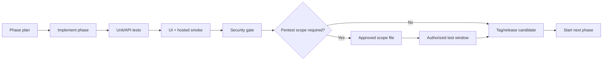

# Nutanix Developer Cloud Studio - Upgrade Path

## Operating Principle

NDC Studio should advance through gated phases. Each phase must prove that the previous phase still works before the next phase is started or promoted.

The gate is deliberately conservative:

- Build and type checks must pass.
- Unit and API tests must pass.
- End-to-end smoke tests must pass.
- Hosted/on-prem starter validation must pass.
- Dependency audit must pass.
- Secret scanning must pass.
- Penetration or vulnerability testing must only run after authorization and scope are documented.

## Phase Promotion Flow



## Automated Gate

Run locally:

```powershell
.\scripts\run-phase-gate.ps1 -TargetPhase v1.0.0-vm-sandbox-dry-run
```

With an explicitly authorized security scope:

```powershell
.\scripts\run-phase-gate.ps1 `
  -TargetPhase v1.0.0-vm-sandbox-dry-run `
  -PentestScopePath .\PENTEST_SCOPE_TEMPLATE.md `
  -IncludeAuthorizedPentest
```

The script does not perform unsafe or out-of-scope testing. It runs defensive checks and verifies that a scope file exists before any active security testing is treated as a release gate.

## Phase Sequence

### v0.5.0-control-plane

Goal: add the provisioning control-plane skeleton without real infrastructure mutation.

Build:

- Provisioning job queue domain.
- Worker/orchestrator abstraction.
- Job state machine: queued, validating, awaiting approval, provisioning, ready, failed, expired.
- Retry and failure model.
- Audit evidence for every state transition.
- UI for queued/running/failed jobs.
- Provisioning remains disabled unless an adapter explicitly supports a safe action.

Exit gate:

- Existing smoke tests pass.
- Hosted validation passes.
- Job queue tests cover success, failure, retry, and approval pause.
- Security review confirms no untrusted shell execution or unsafe path handling.

### v0.6.0-provisioning-adapters

Goal: define adapter contracts and what the platform is allowed to create.

Build:

- Provisioning adapter contract for validate, plan, provision, poll, and destroy.
- AHV image registry records.
- NKP namespace/profile registry records.
- NDB profile registry records.
- NUS storage class registry records.
- NAI/GPU endpoint profile records.
- Platform configuration references.
- Simulated destroy lifecycle with teardown queue evidence.

Exit gate:

- Adapter and provider inventory endpoints are covered by tests.
- Destroy lifecycle queues a simulated teardown job.
- Smoke test covers provider readiness and destroy lifecycle.
- Security review covers configuration and sensitive endpoint handling.

### v0.7.0-registry-governance

Goal: govern template and profile publication before real integration.

Build:

- Template version states: draft, published, deprecated.
- Resource profile states and deprecation controls.
- Owner approval before publishing.
- Policy bundle selection per version.

Exit gate:

- Registry governance APIs are covered by unit/API/client tests.
- Admin smoke test covers registry and profile status transitions.
- Audit evidence is written for governance actions.
- Published status remains a planning record and does not enable real provisioning.

### v0.8.0-prism-readonly-inventory

Goal: move from simulated discovery toward real read-only Prism Central inventory.

Build:

- Adapter interface for Prism Central inventory.
- Read-only endpoint configuration.
- Inventory import model for clusters, projects, images, networks, categories, and VMs.
- Discovery evidence and last-sync metadata.
- No create/update/delete API calls.

Exit gate:

- Mock adapter tests pass.
- Real adapter remains disabled unless lab scope is approved.
- Authorized scope file exists before any live endpoint testing.
- Smoke test proves imported inventory appears in registry/admin views.

### v0.9.0-production-foundation

Goal: turn the starter into a production-shaped control plane before enabling real provisioning.

Build:

- OIDC session validation.
- Role-based access control for admin, approval, registry, integration, and provisioning actions.
- Postgres repository implementation and migrations.
- Audit retention model and export boundary.
- Request logging, correlation IDs, rate limits, and security headers.
- CI gates for dependency review, CodeQL, SBOM, and container image scanning.

Exit gate:

- Auth and authorization tests cover permitted and denied access.
- Migration and repository tests pass against a disposable database.
- Security review confirms request logging redacts sensitive values.
- Production deployment remains provisioning-disabled by default.

### v1.0.0-vm-sandbox-dry-run

Goal: design the first VM sandbox path as dry-run only.

Build:

- Linux VM App Sandbox dry-run planning adapter.
- Fixed image/profile/subnet choices from approved registry.
- Owner, cost, expiry, and environment tags.
- Quota, category, image, subnet, project, and expiry validation.
- Approval evidence and rollback/destroy plan preview.

Exit gate:

- Penetration/security scope is approved.
- Test lab is explicitly in scope.
- Dry-run mode passes.
- Manual approval gate is required before real provisioning is enabled.

### v1.1.0-controlled-provisioning

Goal: add the operator gate required before a future narrowly scoped VM provisioning path can be enabled.

Build:

- Controlled provisioning gate attached to VM sandbox dry-run plans.
- Manual approval required for every real create request.
- Rollback and destroy readiness evidence with operator confirmation.
- Runtime kill switch evidence that keeps all mutation calls disabled by default.
- Audit evidence for request, approval, and rejection decisions.

Exit gate:

- Gate request and approval workflow is API-backed and audited.
- Authorized lab scope and test window are still required before real create work.
- Pentest gate remains required for any scoped lab target.
- Real provisioning remains disabled until a future adapter phase.

### v1.2.0-platform-services

Goal: add platform-service planning flows while gating real service provisioning on VM lifecycle proof.

Build:

- NKP namespace request planning.
- Resource quota and network policy metadata.
- NDB profile-backed PostgreSQL request planning.
- NUS storage allocation request planning.
- NAI endpoint request planning with GPU quota and safety approval evidence.
- Backup, retention, rollback, and cleanup metadata.

Exit gate:

- VM lifecycle proof is required before service provisioning can be enabled.
- Each service has rollback/cleanup documentation.
- Stateful services require approval.
- Smoke tests cover blocked planning paths.

### v1.3.0-lifecycle-evidence

Goal: record the evidence required before private-cloud developer platform promotion.

Build:

- Lab authorization scope records.
- Pentest scope evidence.
- VM lifecycle proof records.
- Controlled gate linkage to active lab scope.
- Platform-service linkage to lifecycle proof.

Exit gate:

- Evidence APIs and UI are tested.
- Lifecycle proof remains blocked until controlled create gate is truly approved.
- Real provisioning remains disabled until authorized adapter work.

### v1.4.0-ahv-preflight-boundary

Goal: add the fail-closed AHV execution boundary before any real adapter work.

Build:

- AHV controlled-provisioning adapter interface.
- Disabled real-adapter preflight run records.
- Checks for controlled gate, active lab scope, lifecycle proof, controlled create switch, and adapter enablement.
- Blocked mutation operation evidence.

Exit gate:

- Preflight APIs and UI are tested.
- Prism Central mutation calls remain disabled.
- Real provisioning remains disabled until authorized adapter work.

### v1.5.0-platform-service-preflight

Goal: add fail-closed service adapter boundaries before any real NKP, NDB, NUS, or NAI adapter work.

Build:

- Platform-service preflight adapter interface.
- Disabled real-adapter preflight records for NKP, NDB, NUS, and NAI.
- Checks for request validation, VM lifecycle proof, provider readiness, adapter configuration, and real-adapter switch state.
- Provider-specific blocked operation evidence.

Exit gate:

- Preflight APIs and UI are tested.
- NKP, NDB, NUS, and NAI mutation calls remain disabled.
- Real service provisioning remains disabled until authorized adapter work.

### v1.6.0-production-readiness-review

Goal: record release-gate readiness before any private-cloud platform candidate.

Build:

- Production readiness review records.
- Checks for OIDC boundary, durable state, audit retention, lab authorization, VM lifecycle proof, AHV preflight, platform-service preflight coverage, and provisioning guardrail.
- Admin Overview readiness review UI.

Exit gate:

- Readiness review APIs and UI are tested.
- Review remains evidence-only and does not enable provisioning.
- Blocked checks are visible before private-cloud promotion.

### v1.7.0-private-cloud-developer-platform

Goal: release as an operational internal developer platform candidate.

Build:

- Private-cloud lifecycle operation records.
- Lifecycle operations: extend, suspend, destroy, rebuild.
- Audit export readiness records.
- Admin Operations console.
- Operational runbooks.

Exit gate:

- Lifecycle operation and audit export APIs are covered by tests.
- Admin smoke test covers operations and audit export preparation.
- Production readiness review remains visible before operational promotion.
- Real provisioning remains disabled until an authorized adapter phase.

### v1.8.0-on-prem-packaging-hardening

Goal: harden the private-cloud starter for on-prem deployment evaluation.

Build:

- Compose profile for API, static UI, and durable JSON state.
- Deployment environment matrix for reverse proxy, OIDC headers, data file, audit retention, and rate limits.
- Backup and restore runbook for JSON state and future Postgres repository.
- Health, readiness, and rollback validation script for the on-prem bundle.
- Security checklist for ingress headers, TLS termination, credential references, and log redaction.

Exit gate:

- Package starts cleanly from documented commands.
- Health and readiness checks pass.
- Backup/restore dry-run is documented and tested against sample state.
- Provisioning remains disabled by default.

### v1.9.0-oidc-rbac-hardening

Goal: harden identity and authorization before any live adapter path is considered.

Build:

- Explicit trusted-header deployment mode and denial behavior when headers are incomplete.
- Role-to-action matrix surfaced in API docs and Admin UI.
- Authorization tests for lifecycle, audit export, registry, provider, and preflight actions.
- Operator-facing session diagnostics without exposing sensitive identity claims.
- Runbook for reverse proxy/OIDC integration boundaries.

Exit gate:

- Permitted and denied access tests cover all mutating API groups.
- Hosted/on-prem smoke proves session diagnostics and RBAC guardrails.
- Security review confirms identity headers are documented as trusted-ingress only.
- Real provisioning remains disabled.

### v2.0.0-postgres-repository-hardening

Goal: replace scaffold-only persistence with a tested production repository boundary.

Build:

- Repository contract tests shared by memory, JSON, and Postgres implementations.
- Migration apply/check script for the existing SQL schema.
- Postgres connection configuration validation without logging sensitive values.
- Backup/restore runbook for database mode.
- Fail-closed startup behavior when `NDC_REPOSITORY=postgres` is selected without required configuration.

Exit gate:

- Repository contract tests pass for non-Postgres stores and Postgres validation paths.
- Migration check runs in CI/local phase gate without requiring production credentials.
- Security review confirms database connection values are not logged.
- Real provisioning remains disabled.

### v2.1.0-audit-export-retention-hardening

Goal: harden audit export and retention before any real provider operation is recorded.

Build:

- Audit export manifest records with checksum, event count, and retention window.
- Export destination configuration validation without storing destination credentials.
- Retention policy diagnostics in Admin Operations.
- Tests for export manifest creation and retention enforcement.
- Runbook for audit export storage and restore verification.

Exit gate:

- Audit export APIs and UI are tested.
- Export destination validation does not log sensitive values.
- Retention smoke proves old events are bounded.
- Real provisioning remains disabled.

### v2.2.0-provider-credential-reference-hardening

Goal: harden provider credential references before any live Nutanix adapter can be configured.

Build:

- Credential reference validation for NCI, NKP, NDB, NUS, NCM, and NAI.
- Explicit separation between credential profile names and credential values.
- Admin provider diagnostics for missing, invalid, and approved credential references.
- Tests for provider config validation and redaction boundaries.
- Runbook for mapping references to an external vault or platform credential store.

Exit gate:

- Provider credential reference APIs and UI are tested.
- Validators reject inline sensitive material.
- Logs and audit events contain references only.
- Real provisioning remains disabled.

### v2.3.0-adapter-enable-contract-hardening

Goal: define the explicit enablement contract required before any real Nutanix adapter can move beyond disabled preflight.

Build:

- Adapter enablement records for NCI, NKP, NDB, NUS, NCM, and NAI.
- Required evidence: approved lab scope, credential reference diagnostics, provider readiness, audit export readiness, and rollback owner.
- Admin UI for blocked/ready adapter enablement evidence.
- Tests that real adapters remain disabled unless every evidence item is present.
- Runbook for adapter enablement review.

Exit gate:

- Adapter enablement APIs and UI are tested.
- Missing evidence blocks enablement.
- Real mutation calls remain disabled.
- Pentest scope remains required before live adapter testing.

### v2.4.0-lab-scope-pentest-evidence-hardening

Goal: harden lab authorization and pentest evidence before any live adapter endpoint testing is considered.

Build:

- Versioned lab scope records with target environment, provider coverage, allowed action list, excluded action list, approver, expiry, and evidence references.
- Pentest scope diagnostics that prove authorization, test window, target endpoints, out-of-scope actions, and rollback owner are documented.
- Admin Control Plane view for scope expiry, coverage gaps, and evidence readiness.
- API tests that expired or incomplete scopes block adapter enablement and preflight promotion.
- Runbook for authorized lab endpoint testing and stop conditions.

Exit gate:

- Lab scope diagnostics APIs and UI are tested.
- Expired or incomplete scope blocks adapter enablement review.
- Pentest evidence is metadata-only and does not store secrets.
- Real mutation calls remain disabled.

### v2.5.0-preflight-destroy-rollback-hardening

Goal: harden rollback and destroy proof before any controlled create adapter can be authorized.

Build:

- Destroy and rollback preflight records tied to VM sandbox dry-run plans.
- Checks for backup/export evidence, owner notification, rollback owner, teardown order, inventory reconciliation, and audit export readiness.
- Admin Control Plane view for rollback/destroy proof gaps and stop conditions.
- Tests that controlled create remains blocked when destroy or rollback proof is missing.
- Runbook for rollback rehearsal and stop-the-line operator actions.

Exit gate:

- Rollback and destroy proof APIs and UI are tested.
- Missing rollback or destroy evidence blocks controlled create promotion.
- Audit records are produced for proof review.
- Real mutation calls remain disabled.

### v2.6.0-controlled-create-adapter-authorization-envelope

Goal: define the final authorization envelope for a future narrowly scoped AHV create adapter without enabling live mutation yet.

Build:

- Consolidated authorization envelope combining lab scope, rollback/destroy proof, controlled gate approval, lifecycle proof, adapter enablement, audit export, and pentest gate status.
- API endpoint and Admin Control Plane panel that shows exactly which evidence blocks live adapter authorization.
- Tests proving the envelope remains blocked when active pentest scope is absent.
- Runbook for the future adapter implementation, including allowed create fields, rollback trigger, kill switch, and emergency stop procedure.

Exit gate:

- Authorization envelope APIs and UI are tested.
- Missing active pentest scope blocks live adapter authorization.
- Real mutation calls remain disabled.

### v2.7.0-controlled-create-adapter-contract

Goal: define the real AHV create adapter contract and dry-run-to-live payload mapping while keeping execution disabled.

Build:

- AHV create adapter interface with validate, map payload, execute disabled, poll disabled, and rollback disabled methods.
- Payload mapping from approved VM sandbox dry-run fields to the future Prism Central create request.
- Contract tests proving disallowed fields are rejected and execute remains disabled without authorization envelope approval.
- Admin Control Plane view for payload preview, blocked mutation operations, and adapter kill switch status.

Exit gate:

- Adapter contract APIs and UI are tested.
- Payload mapping contains only approved fields.
- Execute path remains disabled without authorized pentest scope and explicit adapter release.

### v2.8.0-platform-service-adapter-contracts

Goal: define disabled real-adapter contracts for NKP, NDB, NUS, and NAI service creation before any live service mutation is considered.

Build:

- Service adapter interfaces with validate, map payload, execute disabled, poll disabled, and rollback disabled methods.
- Payload mapping from platform-service request/preflight records to future provider requests.
- Admin Control Plane view for service payload previews, blocked operations, and per-provider kill switch status.
- Tests proving service payload fields stay allowlisted and execute paths remain disabled.

Exit gate:

- Service adapter contract APIs and UI are tested.
- Payload mappings contain only approved request fields.
- NKP, NDB, NUS, and NAI execute paths remain disabled without authorized scope and explicit adapter release.

### v2.9.0-provider-release-gate-evidence

Goal: define the evidence envelope required before any provider adapter can be considered for a controlled lab release.

Build:

- Provider release gate records for NCI, NKP, NDB, NUS, and NAI.
- Checks for active lab scope, credential reference diagnostics, lifecycle proof, provider-specific preflight, adapter contract review, audit export, rollback owner, and explicit release approver.
- Admin Control Plane view that summarizes which provider is closest to a controlled lab release.
- Tests proving missing evidence blocks release and all real adapter switches remain disabled.

Exit gate:

- Provider release gate APIs and UI are tested.
- Missing authorization, evidence, or approver data blocks release.
- Real adapter execution remains disabled unless a future authorized implementation phase explicitly changes it.

### v2.10.0-release-evidence-export-hardening

Goal: make provider release evidence exportable and reviewable for operations, security, and platform owners.

Build:

- Release evidence export records linked to provider release gates.
- Redacted JSON manifest for scope, checks, approver, blocked operations, and kill switch status.
- Admin Operations view for release evidence export history.
- Tests proving export manifests do not include inline credentials or endpoint secrets.

Exit gate:

- Export APIs and UI are tested.
- Release evidence exports contain references and metadata only.
- Real adapter execution remains disabled.

### v2.11.0-provider-release-dashboard-hardening

Goal: make provider release readiness easier to compare across NCI, NKP, NDB, NUS, and NAI.

Build:

- Provider release readiness summary grouped by provider.
- Evidence gap counts for scope, credential, lifecycle, preflight, contract, audit, and approver checks.
- Admin dashboard cards for nearest-to-ready and most-blocked provider.
- Tests proving summary counts match release gate records.

Exit gate:

- Summary APIs and UI are tested.
- Release readiness remains evidence-only.
- Real adapter execution remains disabled.

### v2.12.0-controlled-lab-release-runbook

Goal: document the exact human runbook required before any future controlled lab adapter release can be proposed.

Build:

- Operator runbook records linked to provider release readiness.
- Required sign-offs for platform owner, security reviewer, rollback owner, and lab owner.
- Admin Operations runbook checklist for stop conditions and escalation contacts.
- Tests proving missing sign-offs block runbook completion.

Exit gate:

- Runbook APIs and UI are tested.
- Runbook completion remains evidence-only.
- Real adapter execution remains disabled.

### v2.13.0-controlled-lab-dry-run-window

Goal: schedule a controlled lab dry-run window without allowing provider mutation.

Build:

- Controlled lab dry-run window records with start time, end time, provider, and owner references.
- Links to controlled lab release runbook, release evidence export, lab scope, rollback owner, and emergency stop contacts.
- Admin Operations readiness checklist for window approval, rollback standby, audit export readiness, and stop-the-line contacts.
- Tests proving missing runbook, lab scope, rollback owner, or audit evidence blocks window readiness.

Exit gate:

- Window APIs and UI are tested.
- Window scheduling remains evidence-only.
- Real adapter execution remains disabled.

### v2.14.0-lab-window-evidence-export

Goal: make controlled lab dry-run window evidence exportable for operations, security, and platform review.

Build:

- Lab window evidence export records linked to controlled lab dry-run windows.
- Redacted metadata manifest containing runbook, release evidence export, lab scope, rollback owner, emergency contacts, readiness checks, and disabled execution state.
- Admin Operations export history for lab window evidence.
- Tests proving exports contain references and metadata only.

Exit gate:

- Lab window evidence export APIs and UI are tested.
- Exports contain no inline auth material.
- Real adapter execution remains disabled.

### v2.15.0-lab-evidence-review-queue

Goal: add a human review queue for controlled lab window evidence packages before any future lab execution proposal.

Build:

- Lab evidence review records linked to lab window evidence exports.
- Reviewer decisions for platform owner, security reviewer, and operations reviewer.
- Admin Operations review queue showing accepted, rejected, and blocked evidence packages.
- Tests proving missing reviewer decisions block review completion.

Exit gate:

- Review APIs and UI are tested.
- Review records remain evidence-only.
- Real adapter execution remains disabled.

### v2.16.0-lab-execution-proposal-envelope

Goal: create the final evidence envelope for a future controlled lab execution proposal without enabling adapter execution.

Build:

- Lab execution proposal envelope records linked to accepted lab evidence reviews.
- Checks for lab scope, runbook, dry-run window, window evidence export, review acceptance, rollback owner, audit export, and emergency contacts.
- Admin Operations proposal readiness panel.
- Tests proving missing or rejected review evidence blocks proposal readiness.

Exit gate:

- Proposal envelope APIs and UI are tested.
- Proposal envelopes remain evidence-only.
- Real adapter execution remains disabled.

### v2.17.0-lab-execution-proposal-export

Goal: make lab execution proposal envelopes exportable for final operations and security review.

Build:

- Proposal envelope export records linked to lab execution proposal envelopes.
- Redacted metadata manifest containing proposal checks, evidence references, rollback owner, emergency contacts, kill switch state, and disabled execution state.
- Admin Operations proposal export history.
- Tests proving proposal exports contain references and metadata only.

Exit gate:

- Proposal export APIs and UI are tested.
- Exports contain no inline auth material.
- Real adapter execution remains disabled.

### v2.18.0-controlled-lab-execution-approval-gate

Goal: add final human approvals for exported lab execution proposals before any future controlled lab execution phase.

Build:

- Controlled lab execution approval records linked to proposal exports.
- Platform owner, security reviewer, lab owner, rollback owner, and executive sponsor decisions.
- Admin Operations approval gate panel with blockers and evidence references.
- Tests proving missing or rejected approvals block advancement.

Exit gate:

- Approval gate APIs and UI are tested.
- Approval records remain evidence-only.
- Real adapter execution remains disabled.

### v2.19.0-controlled-lab-execution-rehearsal-packet

Goal: freeze the approved execution evidence into a rehearsal packet before any future live-lab adapter operation.

Build:

- Controlled lab execution rehearsal packet records linked to approved execution gates.
- Frozen references for runbook, rollback owner, emergency contacts, stop conditions, proposal export, audit export, and approval evidence.
- Admin Operations rehearsal packet panel with blockers and evidence references.
- Tests proving missing approval gates or incomplete evidence block packet readiness.

Exit gate:

- Rehearsal packet APIs and UI are tested.
- Rehearsal packets remain evidence-only.
- Real adapter execution remains disabled.

### v2.20.0-controlled-lab-dry-run-execution-checklist

Goal: add a final dry-run execution checklist before any future live-lab adapter operation can be considered.

Build:

- Controlled lab dry-run execution checklist records linked to rehearsal packets.
- Operator roster, observation window, log capture, rollback timer, stop authority, and disabled execution state checks.
- Admin Operations dry-run checklist panel with blockers and evidence references.
- Tests proving missing rehearsal packets or checklist evidence block readiness.

Exit gate:

- Dry-run checklist APIs and UI are tested.
- Checklists remain evidence-only.
- Real adapter execution remains disabled.

### v2.21.0-controlled-lab-execution-evidence-ledger

Goal: add an immutable evidence ledger after dry-run checklist readiness while still keeping real adapter execution disabled.

Build:

- Controlled lab execution evidence ledger records linked to dry-run checklists.
- Immutable evidence references for operator, observer, rollback, log, audit, and stop authority records.
- Admin Operations evidence ledger panel with blockers and evidence references.
- Tests proving missing dry-run checklists or incomplete evidence blocks ledger readiness.

Exit gate:

- Evidence ledger APIs and UI are tested.
- Ledger records remain evidence-only.
- Real adapter execution remains disabled.

### v2.22.0-controlled-lab-execution-readiness-attestation

Goal: record final readiness attestations after evidence ledger readiness while still keeping real adapter execution disabled.

Build:

- Controlled lab execution readiness attestation records linked to evidence ledgers.
- Platform, security, operations, rollback, and sponsor attestation decisions.
- Admin Operations readiness attestation panel with blockers and evidence references.
- Tests proving missing evidence ledgers or incomplete attestations block readiness.

Exit gate:

- Readiness attestation APIs and UI are tested.
- Attestations remain evidence-only.
- Real adapter execution remains disabled.

### v2.23.0-execution-broker-hardening

Goal: introduce a hardened execution broker contract before any future real adapter operation can be considered.

Build:

- Execution broker queue records for future controlled adapter work.
- Idempotency keys, kill-switch checks, approval evidence links, and operator review state.
- Admin Operations execution broker panel with blockers and evidence references.
- Tests proving missing attestations, duplicate idempotency keys, or enabled real-adapter switches block queue readiness.

Exit gate:

- Execution broker APIs and UI are tested.
- Broker records remain queued for operator review only.
- Real adapter execution remains disabled.

### v2.24.0-execution-broker-dispatch-approval

Goal: add the final non-executing dispatch approval boundary before any brokered request can be considered for authorized lab execution.

Build:

- Dispatch approval records linked to execution broker queue records.
- Rollback proof, operator approver, pentest evidence, and dispatch window references.
- Admin Operations dispatch approval panel with blockers and evidence references.
- Tests proving missing broker records, rollback proof, pentest evidence, or approver evidence block dispatch readiness.

Exit gate:

- Dispatch approval APIs and UI are tested.
- Dispatch approval records remain non-executing.
- Real adapter execution remains disabled unless an authorized real-adapter lab scope exists.

### v2.25.0-real-adapter-lab-scope-activation

Goal: add explicit lab-scope activation evidence before any real-adapter switch can be considered.

Build:

- Real-adapter lab scope activation records linked to dispatch approvals.
- Authorized scope, pentest completion evidence, rollback owner, bounded provider target references, and manual operator controls.
- Admin Operations lab scope activation panel with blockers and evidence references.
- Tests proving missing dispatch approvals, pentest completion evidence, rollback ownership, or bounded targets block activation readiness.

Exit gate:

- Lab scope activation APIs and UI are tested.
- Real adapter switches remain disabled until activation evidence is complete.
- No production infrastructure mutation is possible from the prototype.

### v2.26.0-manual-real-adapter-switch-review

Goal: add a manual review record before any authorized lab operator changes real-adapter switch configuration.

Build:

- Manual real-adapter switch review records linked to lab scope activations.
- Named switch operator, second reviewer, maintenance window, switch-state audit references, and rollback contact evidence.
- Admin Operations switch review panel with blockers and evidence references.
- Tests proving missing activation records, operator evidence, reviewer evidence, or switch-state audit references block review readiness.

Exit gate:

- Switch review APIs and UI are tested.
- Switch reviews are evidence-only records.
- No switch is changed by the prototype.

### v2.27.0-real-adapter-switch-state-audit-package

Goal: collect pre-change and post-change switch-state evidence after manual switch review without changing adapter configuration from the prototype.

Build:

- Switch-state audit package records linked to manual switch reviews.
- Pre-change and post-change configuration snapshots, reviewer evidence, rollback timer, and retention references.
- Admin Operations switch-state audit panel with blockers and evidence references.
- Tests proving missing switch reviews, config snapshots, reviewer evidence, or retention references block audit package readiness.

Exit gate:

- Switch-state audit package APIs and UI are tested.
- Audit packages are evidence-only records.
- No switch is changed by the prototype.

### v2.28.0-controlled-switch-configuration-request

Goal: record a controlled switch configuration request after switch-state audit package readiness while the prototype remains non-mutating.

Build:

- Controlled switch configuration request records linked to switch-state audit packages.
- Operator confirmation, second reviewer acceptance, rollback timer, retention reference, and final dry-run proof checks.
- Admin Operations controlled switch request panel with blockers and evidence references.
- Tests proving missing ready audit packages, operator confirmation, reviewer acceptance, dry-run proof, or retention references block request readiness.

Exit gate:

- Controlled switch request APIs and UI are tested.
- Request records are evidence-only.
- No switch is changed by the prototype.

### v2.29.0-switch-execution-handoff-package

Goal: prepare an operator handoff package after controlled switch request readiness while keeping execution outside the prototype.

Build:

- Switch execution handoff package records linked to controlled switch requests.
- Operator run sheet, communications plan, observation window, rollback owner acceptance, and execution freeze proof checks.
- Admin Operations switch handoff panel with blockers and evidence references.
- Tests proving missing ready switch requests, run sheets, communications plans, observation windows, rollback owner acceptance, or freeze proof block handoff readiness.

Exit gate:

- Switch handoff package APIs and UI are tested.
- Handoff packages are evidence-only.
- No switch is changed by the prototype.

### v2.30.0-switch-execution-outcome-record

Goal: record the outcome of an authorized out-of-band switch execution after handoff package readiness without executing the switch from the prototype.

Build:

- Switch execution outcome records linked to handoff packages.
- Operator result, post-switch validation, rollback decision, incident bridge log, and audit sign-off checks.
- Admin Operations switch outcome panel with blockers and evidence references.
- Tests proving missing ready handoff packages, result evidence, validation evidence, rollback decision, bridge logs, or audit sign-off block outcome readiness.

Exit gate:

- Switch outcome APIs and UI are tested.
- Outcome records are evidence-only.
- No switch is changed by the prototype.

### v2.31.0-switch-closure-retention-package

Goal: close out an out-of-band switch outcome with retained evidence before any future adapter promotion is considered.

Build:

- Switch closure retention package records linked to outcome records.
- Closure owner, retained evidence manifest, lessons learned, rollback timer closure, and final audit retention confirmation checks.
- Admin Operations switch closure panel with blockers and evidence references.
- Tests proving missing ready outcome records, retained manifests, lessons learned, rollback closure, or audit retention confirmation block closure readiness.

Exit gate:

- Switch closure package APIs and UI are tested.
- Closure packages are evidence-only.
- No switch is changed by the prototype.

### v2.32.0-adapter-promotion-readiness-dossier

Goal: assemble retained switch closure evidence into an adapter promotion readiness dossier without enabling promotion from the prototype.

Build:

- Adapter promotion readiness dossier records linked to switch closure packages.
- Promotion owner, retained switch evidence, monitoring plan, rollback drill confirmation, and security acceptance checks.
- Admin Operations adapter promotion dossier panel with blockers and evidence references.
- Tests proving missing ready closure packages, retained evidence, monitoring plans, rollback drill confirmations, or security acceptance block promotion dossier readiness.

Exit gate:

- Adapter promotion dossier APIs and UI are tested.
- Promotion dossiers are evidence-only.
- No adapter is promoted by the prototype.

### v2.33.0-production-adapter-authorization-packet

Goal: prepare a production adapter authorization packet after adapter promotion readiness without promoting adapters from the prototype.

Build:

- Production adapter authorization packet records linked to adapter promotion dossiers.
- Production approver, change ticket, release window, emergency rollback authorization, and compliance acceptance checks.
- Admin Operations production authorization panel with blockers and evidence references.
- Tests proving missing ready promotion dossiers, production approvers, change tickets, release windows, rollback authorization, or compliance acceptance block authorization packet readiness.

Exit gate:

- Production authorization packet APIs and UI are tested.
- Authorization packets are evidence-only.
- No adapter is promoted by the prototype.

### v2.34.0-production-change-freeze-record

Goal: record a production change freeze after authorization packet readiness without promoting adapters from the prototype.

Build:

- Production change freeze records linked to production adapter authorization packets.
- Freeze owner, freeze window, stakeholder notification, rollback standby, and no-change exception plan checks.
- Admin Operations production freeze panel with blockers and evidence references.
- Tests proving missing ready authorization packets, freeze owners, freeze windows, stakeholder notifications, rollback standby, or exception plans block freeze readiness.

Exit gate:

- Production change freeze APIs and UI are tested.
- Freeze records are evidence-only.
- No adapter is promoted by the prototype.

### v2.35.0-production-cab-handoff-packet

Goal: prepare a production CAB handoff packet after change freeze readiness without promoting adapters from the prototype.

Build:

- Production CAB handoff packet records linked to production change freeze records.
- CAB owner, agenda reference, risk acceptance, rollback representation, and final go/no-go agenda checks.
- Admin Operations CAB handoff panel with blockers and evidence references.
- Tests proving missing ready freeze records, CAB owners, agenda references, risk acceptance, rollback representation, or go/no-go agenda evidence block CAB handoff readiness.

Exit gate:

- Production CAB handoff APIs and UI are tested.
- CAB handoff packets are evidence-only.
- No adapter is promoted by the prototype.

### v2.36.0-production-cab-decision-record

Goal: record the external CAB decision after CAB handoff readiness without promoting adapters from the prototype.

Build:

- Production CAB decision records linked to CAB handoff packets.
- CAB decision, decision authority, condition list, rollback approval, and decision minutes checks.
- Admin Operations CAB decision panel with blockers and evidence references.
- Tests proving missing ready CAB handoff packets, CAB decisions, decision authority, condition lists, rollback approval, or decision minutes block decision readiness.

Exit gate:

- Production CAB decision APIs and UI are tested.
- CAB decision records are evidence-only.
- No adapter is promoted by the prototype.

### v2.37.0-production-implementation-hold-record

Goal: record a production implementation hold after CAB decision readiness without promoting adapters from the prototype.

Build:

- Production implementation hold records linked to CAB decision records.
- Implementation owner, hold window, condition acceptance, rollback implementation owner, and release freeze acknowledgment checks.
- Admin Operations implementation hold panel with blockers and evidence references.
- Tests proving missing ready CAB decision records, implementation owners, hold windows, condition acceptance, rollback implementation ownership, or freeze acknowledgment block hold readiness.

Exit gate:

- Production implementation hold APIs and UI are tested.
- Implementation hold records are evidence-only.
- No adapter is promoted by the prototype.

### v2.38.0-production-operator-assignment-record

Goal: record production operator assignment after implementation hold readiness without promoting adapters from the prototype.

Build:

- Production operator assignment records linked to implementation hold records.
- Primary operator, secondary operator, execution channel, rollback operator, and privileged access confirmation checks.
- Admin Operations operator assignment panel with blockers and evidence references.
- Tests proving missing ready implementation hold records, operators, execution channels, rollback operators, or privileged access confirmations block assignment readiness.

Exit gate:

- Production operator assignment APIs and UI are tested.
- Operator assignment records are evidence-only.
- No adapter is promoted by the prototype.

### v2.39.0-production-execution-readiness-record

Goal: record production execution readiness after operator assignment without executing or promoting adapters from the prototype.

Build:

- Production execution readiness records linked to operator assignment records.
- Execution owner, pre-execution checklist, rollback bridge, monitoring observer, and implementation timer checks.
- Admin Operations execution readiness panel with blockers and evidence references.
- Tests proving missing ready operator assignment records, execution owners, pre-execution checklists, rollback bridges, monitoring observers, or implementation timers block execution readiness.

Exit gate:

- Production execution readiness APIs and UI are tested.
- Execution readiness records are evidence-only.
- No adapter is promoted or executed by the prototype.

### v2.40.0-production-execution-authorization-record

Goal: record production execution authorization after execution readiness without executing or promoting adapters from the prototype.

Build:

- Production execution authorization records linked to execution readiness records.
- Authorization authority, final go/no-go decision, rollback bridge confirmation, monitoring bridge confirmation, and emergency stop authority checks.
- Admin Operations execution authorization panel with blockers and evidence references.
- Tests proving missing ready execution readiness records, authorization authorities, final decisions, rollback bridge confirmations, monitoring bridge confirmations, or emergency stop authorities block execution authorization.

Exit gate:

- Production execution authorization APIs and UI are tested.
- Execution authorization records are evidence-only.
- No adapter is promoted or executed by the prototype.

### v2.41.0-production-change-ticket-lock-record

Goal: lock production change ticket evidence after execution authorization without executing or promoting adapters from the prototype.

Build:

- Production change ticket lock records linked to execution authorization records.
- Change ticket lock, release window lock, approver roster lock, rollback bridge lock, and monitoring bridge lock checks.
- Admin Operations change ticket lock panel with blockers and evidence references.
- Tests proving missing ready execution authorization records, change ticket locks, release window locks, approver roster locks, rollback bridge locks, or monitoring bridge locks block change ticket lock readiness.

Exit gate:

- Production change ticket lock APIs and UI are tested.
- Change ticket lock records are evidence-only.
- No adapter is promoted or executed by the prototype.

### v2.42.0-production-final-execution-packet-record

Goal: prepare final production execution packet evidence after change ticket lock without executing or promoting adapters from the prototype.

Build:

- Production final execution packet records linked to change ticket lock records.
- Final packet manifest, operator run sheet, communications proof, observation window, and final rollback standby confirmation checks.
- Admin Operations final execution packet panel with blockers and evidence references.
- Tests proving missing ready change ticket lock records, final packet manifests, operator run sheets, communications proofs, observation windows, or final rollback standby confirmations block final execution packet readiness.

Exit gate:

- Production final execution packet APIs and UI are tested.
- Final execution packet records are evidence-only.
- No adapter is promoted or executed by the prototype.

### v2.43.0-production-execution-hold-point-record

Goal: record final production execution hold-point evidence after the final execution packet without executing or promoting adapters from the prototype.

Build:

- Production execution hold-point records linked to final execution packet records.
- Hold-point owner, final stop/go checkpoint, rollback timer checkpoint, monitoring readiness checkpoint, and incident bridge checkpoint checks.
- Admin Operations execution hold-point panel with blockers and evidence references.
- Tests proving missing ready final execution packet records, hold-point owners, final stop/go checkpoints, rollback timer checkpoints, monitoring readiness checkpoints, or incident bridge checkpoints block execution hold-point readiness.

Exit gate:

- Production execution hold-point APIs and UI are tested.
- Execution hold-point records are evidence-only.
- No adapter is promoted or executed by the prototype.

### v2.44.0-production-execution-outcome-authorization-record

Goal: record production execution outcome authorization evidence after execution hold-point readiness without executing or promoting adapters from the prototype.

Build:

- Production execution outcome authorization records linked to execution hold-point records.
- Outcome authority, expected result envelope, rollback decision rule, incident declaration rule, and evidence capture rule checks.
- Admin Operations execution outcome authorization panel with blockers and evidence references.
- Tests proving missing ready execution hold-point records, outcome authorities, expected result envelopes, rollback decision rules, incident declaration rules, or evidence capture rules block outcome authorization readiness.

Exit gate:

- Production execution outcome authorization APIs and UI are tested.
- Execution outcome authorization records are evidence-only.
- No adapter is promoted or executed by the prototype.

### v2.45.0-production-execution-closure-authorization-record

Goal: record production execution closure authorization evidence after outcome authorization readiness without executing or promoting adapters from the prototype.

Build:

- Production execution closure authorization records linked to outcome authorization records.
- Closure authority, success criteria, rollback closure criteria, incident closure criteria, and audit capture confirmation checks.
- Admin Operations execution closure authorization panel with blockers and evidence references.
- Tests proving missing ready outcome authorization records, closure authorities, success criteria, rollback closure criteria, incident closure criteria, or audit capture confirmations block execution closure readiness.

Exit gate:

- Production execution closure authorization APIs and UI are tested.
- Execution closure authorization records are evidence-only.
- No adapter is promoted or executed by the prototype.

### v2.46.0-production-execution-closure-packet-record

Goal: record production execution closure packet evidence after closure authorization readiness without executing or promoting adapters from the prototype.

Build:

- Production execution closure packet records linked to closure authorization records.
- Closure packet manifest, evidence bundle reference, audit export reference, stakeholder notification proof, and retention handoff confirmation checks.
- Admin Operations execution closure packet panel with blockers and evidence references.
- Tests proving missing ready closure authorization records, closure packet manifests, evidence bundle references, audit export references, stakeholder notification proofs, or retention handoff confirmations block execution closure packet readiness.

Exit gate:

- Production execution closure packet APIs and UI are tested.
- Execution closure packet records are evidence-only.
- No adapter is promoted or executed by the prototype.

### v2.47.0-production-execution-archival-handoff-record

Goal: record production execution archival handoff evidence after closure packet readiness without executing or promoting adapters from the prototype.

Build:

- Production execution archival handoff records linked to closure packet records.
- Archive owner, retention policy reference, immutable storage proof, audit index reference, and retrieval test reference checks.
- Admin Operations execution archival handoff panel with blockers and evidence references.
- Tests proving missing ready closure packet records, archive owners, retention policy references, immutable storage proofs, audit index references, or retrieval test references block execution archival handoff readiness.

Exit gate:

- Production execution archival handoff APIs and UI are tested.
- Execution archival handoff records are evidence-only.
- No adapter is promoted or executed by the prototype.

### v2.48.0-production-execution-retention-attestation-record

Goal: record production execution retention attestation evidence after archival handoff readiness without executing or promoting adapters from the prototype.

Build:

- Production execution retention attestation records linked to archival handoff records.
- Retention owner, retention schedule proof, legal hold check, deletion exception register, and retrieval SLA proof checks.
- Admin Operations execution retention attestation panel with blockers and evidence references.
- Tests proving missing ready archival handoff records, retention owners, retention schedule proofs, legal hold checks, deletion exception registers, or retrieval SLA proofs block execution retention attestation readiness.

Exit gate:

- Production execution retention attestation APIs and UI are tested.
- Execution retention attestation records are evidence-only.
- No adapter is promoted or executed by the prototype.

### v2.49.0-production-execution-final-archive-certification-record

Goal: record production execution final archive certification evidence after retention attestation readiness without executing or promoting adapters from the prototype.

Build:

- Production execution final archive certification records linked to retention attestation records.
- Certification owner, final archive manifest, retention lock proof, compliance sign-off, and retrieval witness proof checks.
- Admin Operations final archive certification panel with blockers and evidence references.
- Tests proving missing ready retention attestation records, certification owners, final archive manifests, retention lock proofs, compliance sign-offs, or retrieval witness proofs block final archive certification readiness.

Exit gate:

- Production execution final archive certification APIs and UI are tested.
- Final archive certification records are evidence-only.
- No adapter is promoted or executed by the prototype.

### v2.50.0-production-execution-completion-dossier-record

Goal: record production execution completion dossier evidence after final archive certification readiness without executing or promoting adapters from the prototype.

Build:

- Production execution completion dossier records linked to final archive certification records.
- Dossier owner, final evidence index, audit export reference, operations acceptance, and compliance closure proof checks.
- Admin Operations completion dossier panel with blockers and evidence references.
- Tests proving missing ready final archive certification records, dossier owners, final evidence indexes, audit export references, operations acceptance, or compliance closure proofs block completion dossier readiness.

Exit gate:

- Production execution completion dossier APIs and UI are tested.
- Completion dossier records are evidence-only.
- No adapter is promoted or executed by the prototype.

### v2.51.0-production-execution-operations-handover-record

Goal: record production execution operations handover evidence after completion dossier readiness without executing or promoting adapters from the prototype.

Build:

- Production execution operations handover records linked to completion dossier records.
- Operations owner, support model reference, monitoring handover proof, escalation route, and service desk acceptance checks.
- Admin Operations operations handover panel with blockers and evidence references.
- Tests proving missing ready completion dossier records, operations owners, support model references, monitoring handover proofs, escalation routes, or service desk acceptance records block operations handover readiness.

Exit gate:

- Production execution operations handover APIs and UI are tested.
- Operations handover records are evidence-only.
- No adapter is promoted or executed by the prototype.

### v2.52.0-production-execution-support-readiness-record

Goal: record production execution support readiness evidence after operations handover readiness without executing or promoting adapters from the prototype.

Build:

- Production execution support readiness records linked to operations handover records.
- Support owner, runbook acceptance, alert routing proof, incident process reference, and knowledge base publication checks.
- Admin Operations support readiness panel with blockers and evidence references.
- Tests proving missing ready operations handover records, support owners, runbook acceptance records, alert routing proofs, incident process references, or knowledge base publication records block support readiness.

Exit gate:

- Production execution support readiness APIs and UI are tested.
- Support readiness records are evidence-only.
- No adapter is promoted or executed by the prototype.

### v2.53.0-production-execution-service-acceptance-record

Goal: record production execution service acceptance evidence after support readiness without executing or promoting adapters from the prototype.

Build:

- Production execution service acceptance records linked to support readiness records.
- Service owner, acceptance criteria reference, operational SLO reference, support sign-off, and final customer notification checks.
- Admin Operations service acceptance panel with blockers and evidence references.
- Tests proving missing ready support readiness records, service owners, acceptance criteria references, operational SLO references, support sign-offs, or customer notifications block service acceptance.

Exit gate:

- Production execution service acceptance APIs and UI are tested.
- Service acceptance records are evidence-only.
- No adapter is promoted or executed by the prototype.

### v2.54.0-production-execution-final-turnover-record

Goal: record final service turnover evidence after service acceptance without executing or promoting adapters from the prototype.

Build:

- Production execution final turnover records linked to service acceptance records.
- Turnover owner, final service catalog reference, ownership transfer proof, executive closure note, and post-implementation review schedule checks.
- Admin Operations final turnover panel with blockers and evidence references.
- Tests proving missing ready service acceptance records, turnover owners, service catalog references, ownership transfer proof, executive closure notes, or post-implementation review schedules block final turnover.

Exit gate:

- Production execution final turnover APIs and UI are tested.
- Final turnover records are evidence-only.
- No adapter is promoted or executed by the prototype.

### v2.55.0-production-execution-operational-closure-record

Goal: record operational closure evidence after final turnover without executing or promoting adapters from the prototype.

Build:

- Production execution operational closure records linked to final turnover records.
- Closure owner, steady-state operating model, SLO review proof, support backlog handoff, and residual-risk acceptance checks.
- Admin Operations operational closure panel with blockers and evidence references.
- Tests proving missing ready final turnover records, closure owners, operating models, SLO review proof, backlog handoffs, or residual-risk acceptance block operational closure.

Exit gate:

- Production execution operational closure APIs and UI are tested.
- Operational closure records are evidence-only.
- No adapter is promoted or executed by the prototype.

### v2.56.0-production-execution-post-implementation-review-record

Goal: record post-implementation review evidence after operational closure without executing or promoting adapters from the prototype.

Build:

- Production execution post-implementation review records linked to operational closure records.
- Review owner, PIR minutes, incident review proof, cost variance review, and improvement backlog reference checks.
- Admin Operations post-implementation review panel with blockers and evidence references.
- Tests proving missing ready operational closure records, review owners, PIR minutes, incident reviews, cost variance reviews, or improvement backlog references block post-implementation review readiness.

Exit gate:

- Production execution post-implementation review APIs and UI are tested.
- Post-implementation review records are evidence-only.
- No adapter is promoted or executed by the prototype.

### v2.57.0-production-execution-improvement-closure-record

Goal: record improvement closure evidence after post-implementation review without executing or promoting adapters from the prototype.

Build:

- Production execution improvement closure records linked to post-implementation review records.
- Improvement owner, action register, accepted deferrals, lessons-learned publication, and next-cycle owner checks.
- Admin Operations improvement closure panel with blockers and evidence references.
- Tests proving missing ready post-implementation review records, improvement owners, action registers, accepted deferrals, lessons-learned publications, or next-cycle owners block improvement closure.

Exit gate:

- Production execution improvement closure APIs and UI are tested.
- Improvement closure records are evidence-only.
- No adapter is promoted or executed by the prototype.

### v2.58.0-production-execution-final-acceptance-archive-record

Goal: record final acceptance archive evidence after improvement closure without executing or promoting adapters from the prototype.

Build:

- Production execution final acceptance archive records linked to improvement closure records.
- Archive owner, acceptance archive index, final evidence checksum, stakeholder receipt proof, and retrieval owner checks.
- Admin Operations final acceptance archive panel with blockers and evidence references.
- Tests proving missing ready improvement closure records, archive owners, archive indexes, final evidence checksums, stakeholder receipt proof, or retrieval owners block final acceptance archive.

Exit gate:

- Production execution final acceptance archive APIs and UI are tested.
- Final acceptance archive records are evidence-only.

### v2.59.0-production-execution-readiness-archive-handoff-record

Goal: record readiness archive handoff evidence after final acceptance archive without executing or promoting adapters from the prototype.

Recommended upgrade steps:

- Add production execution readiness archive handoff records linked to final acceptance archive records.
- Require handoff owner, archive repository reference, retrieval runbook, archive access review, and archive custody receipt.
- Add Admin Operations readiness archive handoff panel with blockers and evidence references.
- Add tests proving missing ready final acceptance archive records, handoff owners, archive repositories, retrieval runbooks, access reviews, or custody receipts block readiness archive handoff.

Promotion criteria:

- Production execution readiness archive handoff APIs and UI are tested.
- Readiness archive handoff records are evidence-only.

### v2.60.0-production-execution-archive-retrieval-validation-record

Goal: validate archive retrievability after readiness archive handoff without executing or promoting adapters from the prototype.

Recommended upgrade steps:

- Add production execution archive retrieval validation records linked to readiness archive handoff records.
- Require retrieval operator, sample retrieval proof, checksum verification, access audit, and recovery SLA witness.
- Add Admin Operations archive retrieval validation panel with blockers and evidence references.
- Add tests proving missing ready readiness archive handoff records, retrieval operators, sample retrieval proof, checksum verification, access audits, or recovery SLA witnesses block archive retrieval validation.

Promotion criteria:

- Production execution archive retrieval validation APIs and UI are tested.
- Archive retrieval validation records are evidence-only.

### v2.61.0-production-execution-archive-recovery-drill-record

Goal: record archive recovery drill evidence after archive retrieval validation without executing or promoting adapters from the prototype.

Recommended upgrade steps:

- Add production execution archive recovery drill records linked to archive retrieval validation records.
- Require drill owner, recovery scenario, elapsed recovery proof, restored artifact review, and drill sign-off.
- Add Admin Operations archive recovery drill panel with blockers and evidence references.
- Add tests proving missing ready archive retrieval validation records, drill owners, recovery scenarios, elapsed recovery proof, restored artifact reviews, or drill sign-offs block archive recovery drill readiness.

Promotion criteria:

- Production execution archive recovery drill APIs and UI are tested.
- Archive recovery drill records are evidence-only.

### v2.62.0-production-execution-archive-recovery-acceptance-record

Goal: record archive recovery acceptance evidence after archive recovery drill without executing or promoting adapters from the prototype.

Recommended upgrade steps:

- Add production execution archive recovery acceptance records linked to archive recovery drill records.
- Require acceptance owner, recovery evidence packet, RTO/RPO variance review, residual recovery risk register, and acceptance sign-off.
- Add Admin Operations archive recovery acceptance panel with blockers and evidence references.
- Add tests proving missing ready archive recovery drill records, acceptance owners, recovery evidence packets, RTO/RPO variance reviews, residual recovery risk registers, or acceptance sign-offs block archive recovery acceptance readiness.

Promotion criteria:

- Production execution archive recovery acceptance APIs and UI are tested.
- Archive recovery acceptance records are evidence-only.

### v2.63.0-production-execution-archive-recovery-closure-record

Goal: record archive recovery closure evidence after archive recovery acceptance without executing or promoting adapters from the prototype.

Recommended upgrade steps:

- Add production execution archive recovery closure records linked to archive recovery acceptance records.
- Require closure owner, recovery closure packet, follow-up action register, stakeholder closure notice, and archive recovery closure sign-off.
- Add Admin Operations archive recovery closure panel with blockers and evidence references.
- Add tests proving missing ready archive recovery acceptance records, closure owners, recovery closure packets, follow-up action registers, stakeholder closure notices, or closure sign-offs block archive recovery closure readiness.

Promotion criteria:

- Production execution archive recovery closure APIs and UI are tested.
- Archive recovery closure records are evidence-only.
- No adapter is promoted or executed by the prototype.

## Automatic Implementation Rule

After each phase is implemented, run the phase gate. If it passes:

1. Update `CHANGELOG.md`.
2. Update `docs/project-log.md`.
3. Add release notes under `docs/release-notes/`.
4. Tag the release.
5. Start the next phase from the upgrade path.

If the gate fails, stop phase promotion and fix the failing gate before adding new scope.
