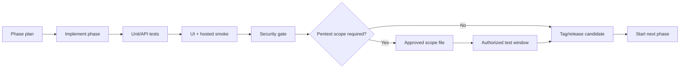

# Nutanix Developer Cloud Studio - Upgrade Path

## Operating Principle

NDC Studio should advance through gated phases. Each phase must prove that the previous phase still works before the next phase is started or promoted.

The gate is deliberately conservative:

- Build and type checks must pass.
- Unit and API tests must pass.
- End-to-end smoke tests must pass.
- Hosted/on-prem starter validation must pass.
- Dependency audit must pass.
- Secret scanning must pass.
- Penetration or vulnerability testing must only run after authorization and scope are documented.

## Phase Promotion Flow



## Automated Gate

Run locally:

```powershell
.\scripts\run-phase-gate.ps1 -TargetPhase v0.5.0-control-plane
```

With an explicitly authorized security scope:

```powershell
.\scripts\run-phase-gate.ps1 `
  -TargetPhase v0.5.0-control-plane `
  -PentestScopePath .\PENTEST_SCOPE_TEMPLATE.md `
  -IncludeAuthorizedPentest
```

The script does not perform unsafe or out-of-scope testing. It runs defensive checks and verifies that a scope file exists before any active security testing is treated as a release gate.

## Phase Sequence

### v0.5.0-control-plane

Goal: add the provisioning control-plane skeleton without real infrastructure mutation.

Build:

- Provisioning job queue domain.
- Worker/orchestrator abstraction.
- Job state machine: queued, validating, awaiting approval, provisioning, ready, failed, expired.
- Retry and failure model.
- Audit evidence for every state transition.
- UI for queued/running/failed jobs.
- Provisioning remains disabled unless an adapter explicitly supports a safe action.

Exit gate:

- Existing smoke tests pass.
- Hosted validation passes.
- Job queue tests cover success, failure, retry, and approval pause.
- Security review confirms no untrusted shell execution or unsafe path handling.

### v0.6.0-template-image-registry

Goal: define what the platform is allowed to create.

Build:

- AHV image registry records.
- NKP namespace/profile registry records.
- NDB profile registry records.
- NUS storage class registry records.
- NAI/GPU endpoint profile records.
- Template version states: draft, published, deprecated.
- Owner approval before publishing.

Exit gate:

- Registry cannot publish incomplete profiles.
- Deprecated profiles cannot be selected for new requests.
- Smoke test covers selecting a published profile.
- Security review covers configuration and sensitive endpoint handling.

### v0.7.0-prism-readonly-inventory

Goal: move from simulated discovery toward real read-only Prism Central inventory.

Build:

- Adapter interface for Prism Central inventory.
- Read-only endpoint configuration.
- Inventory import model for clusters, projects, images, networks, categories, and VMs.
- Discovery evidence and last-sync metadata.
- No create/update/delete API calls.

Exit gate:

- Mock adapter tests pass.
- Real adapter remains disabled unless lab scope is approved.
- Authorized scope file exists before any live endpoint testing.
- Smoke test proves imported inventory appears in registry/admin views.

### v0.8.0-vm-sandbox-provisioning

Goal: first tightly controlled real provisioning path.

Build:

- Linux VM App Sandbox provisioning adapter.
- Fixed image/profile/subnet choices from approved registry.
- Owner, cost, expiry, and environment tags.
- Destroy/expiry workflow design, initially disabled until separately approved.

Exit gate:

- Penetration/security scope is approved.
- Test lab is explicitly in scope.
- Dry-run mode passes.
- Manual approval gate is required before real provisioning is enabled.

### v0.9.0-kubernetes-and-data-services

Goal: add platform services after VM sandbox proves the control plane.

Build:

- NKP namespace provisioning.
- Resource quota and network policy.
- NDB profile-backed PostgreSQL request.
- NUS storage allocation request.
- Backup and retention metadata.

Exit gate:

- Each service has rollback/cleanup documentation.
- Stateful services require approval.
- Smoke tests cover failure and approval paths.

### v1.0.0-private-cloud-developer-platform

Goal: release as an operational internal developer platform candidate.

Build:

- OIDC/SSO integration.
- Role-based access control.
- Production database.
- Audit export.
- Lifecycle operations: extend, suspend, destroy, rebuild.
- Operational runbooks.

Exit gate:

- Auth and authorization tests pass.
- Audit and data-retention review passes.
- Production readiness review is complete.
- Real provisioning is enabled only for approved targets and approved golden paths.

## Automatic Implementation Rule

After each phase is implemented, run the phase gate. If it passes:

1. Update `CHANGELOG.md`.
2. Update `docs/project-log.md`.
3. Add release notes under `docs/release-notes/`.
4. Tag the release.
5. Start the next phase from the upgrade path.

If the gate fails, stop phase promotion and fix the failing gate before adding new scope.
